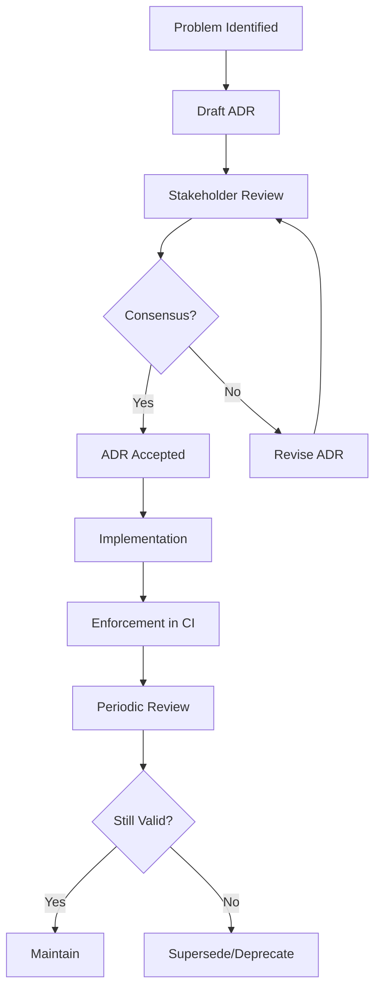

# Complete Architecture Decision Records Collection

> **Status**: Production Ready - Enhanced v2.0  
> **Last Updated**: 2025-07-17  
> **Maintainer**: Platform Engineering Team  
> **Related**: [Enterprise Observability Policies](enterprise-observability-policy.md) | [Implementation Playbook](implementation-playbook.md) | [Platform Engineering Guide](platform-engineering-guide.md) | [Production Operations Handbook](production-operations-handbook.md)

## Executive Summary

This comprehensive Architecture Decision Records (ADR) collection documents the foundational technical decisions governing observability architecture across all participating projects. These ADRs represent battle-tested patterns from production deployments and align with 2025+ cloud-native observability best practices.

**Key Architectural Principles:**

- **Monolith-First Learning** with extraction readiness (ADR-001)
- **Zero Global State** for testability and determinism (ADR-002)  
- **Context-First Propagation** using Go idioms (ADR-003)
- **Bounded Cardinality** with cost governance (ADR-004)
- **Structured Error Classification** for actionable alerting (ADR-005)
- **Local-First Development** with cloud promotion paths (ADR-006)
- **Framework Boundaries** with clear abstraction layers (ADR-007)
- **GCP-First Cloud Strategy** with multi-cloud readiness (ADR-008)
- **PII Governance** with tiered exposure controls (ADR-009)
- **Performance Budgets** with automated enforcement (ADR-010)
- **Signal Access Control** with role-based governance (ADR-011)

## ADR Lifecycle and Governance

### Lifecycle States

1. **Proposed** - Draft under review with stakeholder feedback period
2. **Accepted** - Approved and governing; enforceable in CI/CD
3. **Superseded** - Replaced by newer ADR; retained for traceability
4. **Deprecated** - Intentionally sunset; should not be used in new work

### Governance Process



### Contributing Guidelines

1. **Copy** `../templates/adr-template.md`
2. **Assign** next numeric ID (sequential)
3. **Include** problem statement, options analysis, decision rationale
4. **Link** to motivating issues and related ADRs
5. **Submit** PR with stakeholder review
6. **Update** this index table

---

## Complete ADR Index

| ADR | Title | Status | Key Areas | Business Impact | Implementation Phase |
|-----|-------|--------|-----------|-----------------|---------------------|
| [0000](#adr-0000-adr-index) | ADR Index | Accepted | Governance, Process | Documentation Standards | Foundation |
| [0001](#adr-0001-monolith-first-strategy) | Monolith-First Strategy | Accepted | Architecture, Delivery | Faster Learning, Lower Ops Cost | Phase 1-7 |
| [0002](#adr-0002-zero-global-state) | Zero Global State Architecture | Accepted | Testability, Config | Test Reliability, Parallel Safety | All Phases |
| [0003](#adr-0003-context-first-propagation) | Context-First Propagation | Accepted | Go Idioms, Tracing | Trace Correlation, Cancellation | Phase 2+ |
| [0004](#adr-0004-metric-cardinality-budget) | Metric Cardinality Budget | Accepted | Prometheus, Cost | Cost Control, Query Performance | Phase 4+ |
| [0005](#adr-0005-error-classification) | Error Classification Strategy | Accepted | Alerting, UX | Actionable Alerts, Better UX | Phase 2+ |
| [0006](#adr-0006-local-first-observability) | Local-First Observability | Accepted | Learning, Cost | Faster Development, Learning | Phase 1-5 |
| [0007](#adr-0007-gin-framework-strategy) | Gin Framework Strategy | Accepted | Web Layer, DX | Development Velocity | Phase 1+ |
| [0008](#adr-0008-gcp-first-cloud) | GCP-First Cloud Strategy | Accepted | Cloud, Ops | Production Scalability | Phase 6+ |
| [0009](#adr-0009-pii-governance) | PII Governance & Exposure Modes | Accepted | Security, Compliance | Privacy Compliance, Trust | All Phases |
| [0010](#adr-0010-performance-budgets) | Performance Budgets | Accepted | SRE, Performance | SLA Achievement, User Experience | Phase 5+ |
| [0011](#adr-0011-signal-access-retention) | Signal Access & Retention | Draft | Security, Governance | Compliance, Cost Management | Phase 6+ |

---

## ADR-0000: ADR Index

**Status:** Accepted  
**Date:** 2025-07-17  
**Tags:** index, governance, documentation

### Context

Architecture Decision Records capture stable, reviewed technical decisions that govern observability architecture across participating projects. Without proper indexing and governance, ADRs become scattered documentation that loses value over time.

### Problem Statement

Teams need a centralized, discoverable way to:

- Track architectural decisions and their current status
- Understand decision evolution and supersession chains
- Enforce architectural compliance in CI/CD pipelines
- Onboard new team members with context

### Decision

Implement a structured ADR system with:

- **Immutable historical records** - ADRs are never deleted, only superseded
- **Sequential numbering** starting from 0000 (this index)
- **Standardized template** with required sections
- **Status tracking** through defined lifecycle states
- **Cross-referencing** between related decisions

### Implementation Guidelines

#### ADR Structure

```markdown
# Title
**Status:** [Proposed|Accepted|Superseded|Deprecated]
**Date:** YYYY-MM-DD
**Tags:** comma, separated, tags

## Context
## Problem Statement  
## Options Considered
## Decision
## Rationale
## Implementation
## Consequences
## References
```

#### Enforcement Mechanisms

- **CI Validation**: `scripts/validate-adrs.sh` checks format and links
- **PR Templates**: Require ADR review for architectural changes
- **Quarterly Reviews**: Assess ADR relevance and update status

### Consequences

**Positive:**

- Clear decision audit trail
- Faster onboarding with context
- Architectural compliance enforcement
- Shared understanding across teams

**Negative:**

- Additional documentation overhead
- Requires discipline to maintain
- Can become bureaucratic if over-applied

### References

- [Documenting Architecture Decisions - Michael Nygard](https://cognitect.com/blog/2011/11/15/documenting-architecture-decisions)
- [ADR GitHub Organization](https://adr.github.io/)
