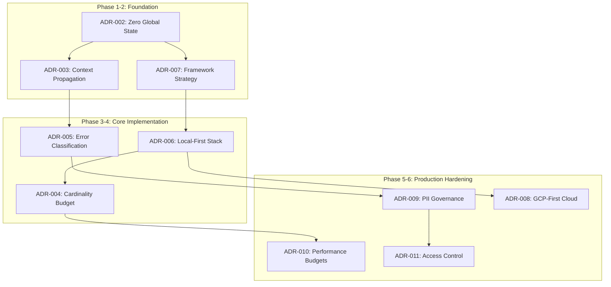

# Summary

This comprehensive Architecture Decision Records collection establishes a **dependency injection first, standards-based, production-ready observability foundation** with clear boundaries and enforcement mechanisms. The architecture supports learning with local tooling while maintaining compatibility with cloud observability services.

## Key Architectural Principles Enforced

| ADR | Principle | Implementation | Enforcement |
|-----|-----------|----------------|-------------|
| **ADR-001** | Monolith-First Learning | Single process, modular boundaries | Import boundary checking |
| **ADR-002** | Zero Global State | All DI, no package vars | Static analysis + golangci-lint |
| **ADR-003** | Context-First Propagation | All functions accept ctx first | EAGER pattern for performance |
| **ADR-004** | Cardinality Budget | ≤1k series, golden file validation | Automated cardinality checking |
| **ADR-005** | Error Classification | AppError + correlation | Single observation point |
| **ADR-006** | Local-First Learning | Docker stack with proper endpoints | Health check automation |
| **ADR-007** | Framework Boundaries | Gin-first, clean abstraction path | Import boundary enforcement |
| **ADR-008** | GCP-First Cloud | Multi-cloud ready architecture | Terraform modular structure |
| **ADR-009** | PII Governance | Tiered exposure controls | Automated redaction + audit |
| **ADR-010** | Performance Budgets | SLO-driven management | Automated enforcement |
| **ADR-011** | Access Control | RBAC with emergency procedures | Comprehensive audit trails |

### Implementation Priority and Dependencies



### Technology Stack Decisions

| Component | Decision | Rationale | Alternatives Considered |
|-----------|----------|-----------|------------------------|
| **HTTP Framework** | Gin | Performance + ecosystem | Chi, Echo, stdlib |
| **Observability Protocol** | OTLP HTTP | Consistency + compatibility | gRPC, mixed protocols |
| **Cloud Platform** | GCP-first | Observability excellence | AWS, Azure, multi-cloud |
| **Container Platform** | Cloud Run | Serverless + observability | GKE, Compute Engine |
| **Local Stack** | Docker Compose | Learning velocity | Kubernetes, manual setup |
| **Metrics Storage** | Prometheus | OpenTelemetry compatibility | Cloud Monitoring only |
| **Trace Storage** | Tempo (local) + Cloud Trace | Hybrid approach | Jaeger, Zipkin |
| **Infrastructure** | Terraform | Multi-cloud readiness | Cloud-specific tools |

### Quality Gates and Enforcement

#### Continuous Integration Checks

```yaml
quality_gates:
  - name: "Import Boundary Enforcement"
    command: "make lint-imports"
    requirement: "Zero violations"
    
  - name: "Cardinality Budget Validation"
    command: "make cardinality-check"
    requirement: "≤1000 series per service"
    
  - name: "Performance Budget Compliance"
    command: "make bench-obs"
    requirement: "<15% latency, <25% memory overhead"
    
  - name: "PII Protection Validation"
    command: "make validate-pii-compliance"
    requirement: "Zero PII leakage in production configs"
    
  - name: "Access Control Testing"
    command: "make test-access-controls"
    requirement: "100% RBAC coverage"
```

### Production Readiness Checklist

Before deploying to production, ensure:

- [ ] **ADR-002**: All dependencies injected via constructors, zero package-level variables
- [ ] **ADR-003**: All exported functions accept `context.Context` as first parameter
- [ ] **ADR-004**: Metric cardinality ≤1000 active series per service
- [ ] **ADR-005**: All errors use structured `AppError` with classification
- [ ] **ADR-006**: Local development stack verified with `make smoke-test`
- [ ] **ADR-007**: Framework code isolated in `api/middleware/` and `api/handlers/`
- [ ] **ADR-008**: GCP infrastructure provisioned via Terraform modules
- [ ] **ADR-009**: PII redaction policies configured for production environment
- [ ] **ADR-010**: Performance budgets defined and SLO monitoring active
- [ ] **ADR-011**: RBAC implemented with audit trails enabled

### Observability Maturity Progression

| Maturity Level | Capabilities | ADRs Implemented | Business Value |
|----------------|--------------|------------------|----------------|
| **Level 1: Basic** | Logs + basic metrics | ADR-002, ADR-003, ADR-006 | Incident detection |
| **Level 2: Structured** | Error classification + correlation | ADR-005, ADR-007 | Faster debugging |
| **Level 3: Governed** | Cardinality + PII controls | ADR-004, ADR-009 | Cost control + compliance |
| **Level 4: Optimized** | Performance budgets + SLOs | ADR-010 | Business alignment |
| **Level 5: Enterprise** | Full RBAC + audit + cloud | ADR-008, ADR-011 | Production-grade operations |

### Future Evolution Paths

#### Phase 7: AI/ML Observability (6+ months)

- **Model monitoring**: Drift detection, performance tracking
- **Feature store observability**: Data quality monitoring
- **Automated anomaly detection**: ML-powered incident detection
- **Predictive alerting**: Proactive issue identification

#### Phase 8: Advanced Platform Engineering (12+ months)

- **Service mesh integration**: Istio/Linkerd observability
- **Multi-cluster observability**: Cross-region monitoring
- **Cost attribution**: Business unit cost allocation
- **Automated remediation**: Self-healing systems

#### Phase 9: Business Intelligence Integration (18+ months)

- **Business metrics correlation**: Technical → business impact
- **Customer journey tracking**: End-to-end user experience
- **Revenue impact analysis**: Reliability → revenue correlation
- **Predictive business analytics**: Operational → business predictions

### Reusability and Template Strategy

This ADR collection serves as a **reusable template** for any Go backend API project:

1. **Copy ADR decisions** that match your architectural requirements
2. **Adapt configurations** for your specific cloud provider and scale
3. **Implement phases incrementally** based on team capacity and business needs
4. **Enforce boundaries** using the provided tooling and validation scripts
5. **Measure and optimize** using the performance budgets and SLO frameworks

The decisions create a foundation that scales from single-service APIs to large-scale distributed systems while maintaining observability excellence and operational discipline.

**Key Success Factors:**

- **Start simple** with local development (ADR-006)
- **Enforce boundaries** from day one (ADR-002, ADR-007)
- **Measure everything** including observability overhead (ADR-010)
- **Protect data** from the beginning (ADR-009, ADR-011)
- **Plan for scale** with modular architecture (ADR-001, ADR-008)

This architecture decision framework ensures that observability becomes a **competitive advantage** rather than technical debt, enabling teams to build reliable, observable, and maintainable systems that support business growth.
