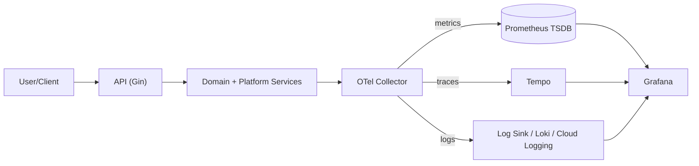

# Go Observability Mastery – Diagrams & Architecture Pack

**Repo:** `docs-observability/`  
**Last Generated:** 2025-07-17  
**Maintainer:** You! (Customize in PR)  

This package contains a curated set of *diagram-first* architecture references that complement the full *Go Observability Mastery* roadmap.  
Use these files as *copy-ready* documentation fragments you can drop into READMEs, design docs, confluence pages, onboarding guides, and slide decks.

---

## What's Included

| File | Purpose | Audience |
|------|---------|----------|
| `architecture-overview.md` | High‑level system view (local + cloud) | Exec / New Dev |
| `architecture-env-split.md` | Side‑by‑side Local vs Cloud vs Prod | Dev / DevOps |
| `signal-flow.md` | Deep signal plumbing (logs, metrics, traces) | Obs / SRE |
| `request-lifecycle.md` | Request → Context → Logger → Trace → Metrics | App Devs |
| `pii-safety-layers.md` | Data classification, redaction points | Security / Compliance |
| `vendor-landscape.md` | OSS vs SaaS observability providers | Eng Leads / CTO |
| `decision-matrix.md` | Choose OSS, Cloud‑Native, or SaaS | Eng Mgmt |
| `diagram-snippets.md` | Reusable mermaid snippets (copy/paste) | Everyone |

> **Formatting Tip:** GitHub Mermaid requires *only* the fenced code block (```mermaid ...). Do **not** include stray text on the same line. Labels with spaces **are OK**; avoid unmatched brackets or stray backticks.

---

## Quick Preview

Below is the compact “Signals-Fanout” diagram used throughout the docs:



---

### Conventions Used in Diagrams

**Shape legend**  
- `[]` Process / runtime component  
- `()` External SaaS / managed service  
- `(())` Data store / TSDB / index  
- `[/ /]` User / persona  
- `>|signal|` Directed labelled edge (metrics/logs/traces)  

**Environment coloring** (when used via Mermaid `classDef`):  
- Green = Local Dev  
- Blue = Shared Staging  
- Purple = Production  
- Orange = External SaaS / Vendor  

---

### Versioning

Regenerate these docs whenever:  
- You add or remove a telemetry backend.  
- You switch transport protocols (OTLP HTTP → gRPC).  
- You promote local stack to managed cloud exporters.  
- You begin vendor consolidation (Datadog / New Relic / Grafana Cloud).  

Mark diagram versions in the file header using front‑matter `last_updated:`.

---

### License

All diagrams and markdown in this pack are MIT licensed unless a vendor logo is embedded (consult brand guidelines before reuse).

---

**Next:** Open any file in `diagrams/` for the full, richly annotated versions.
