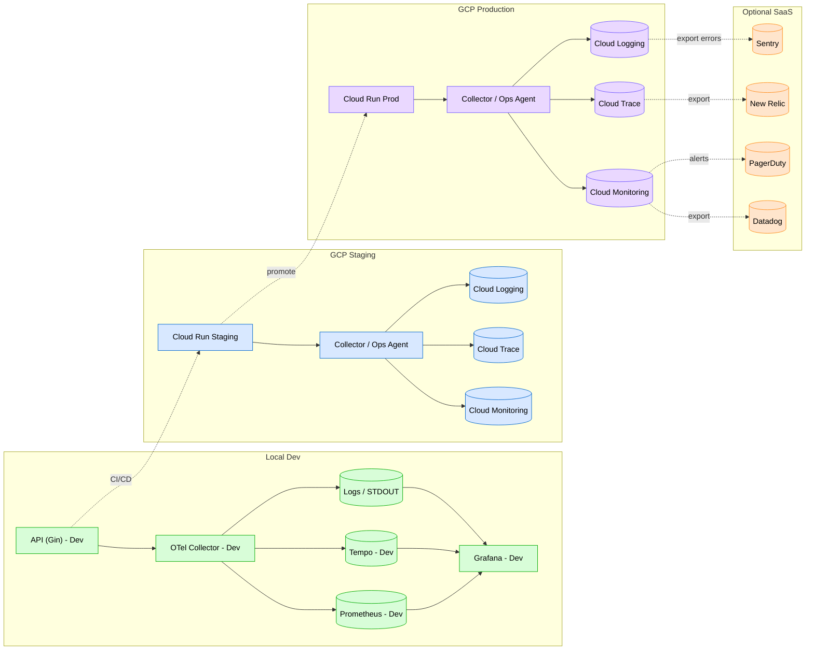

# Environment Split Guide

This doc visually contrasts **Local Dev**, **Shared Staging**, and **Production Cloud** telemetry flows so teams understand *what runs where*, *what's mocked vs managed*, and *what changes when you promote builds*.

---

## Legend

- **Green** – Runs on developer laptop (Docker Compose)
- **Blue** – Shared staging environment (GCP project `-staging`)
- **Purple** – Production environment (GCP project `-prod`)
- **Orange** – Optional SaaS vendor integration (Datadog, Sentry, PagerDuty, etc.)

---

## Combined Environment Map

---

### Promotion Rules

| Signal | Dev | Staging | Production | Notes |
|--------|-----|---------|------------|-------|
| Metrics | Local Prom | Cloud Monitoring | Cloud Monitoring | Export to Datadog optional |
| Traces | Local Tempo | Cloud Trace | Cloud Trace | Sample rates differ by env |
| Logs | stdout / file | Cloud Logging | Cloud Logging | PII mode strict in prod |
| Alerts | none / local | test PD integration | prod PD escalation | Controlled via Terraform |

---

### Sampling Matrix (default)

| Env | Sampling | Error Override | High‑Value Ops | Notes |
|-----|----------|----------------|----------------|-------|
| Dev | 100% | N/A | N/A | Learn everything |
| Staging | 10% | 100% always | 50% targeted | Perf cost reduction |
| Prod | 1% base | 100% errors | 10% curated | Budget aware |

---
