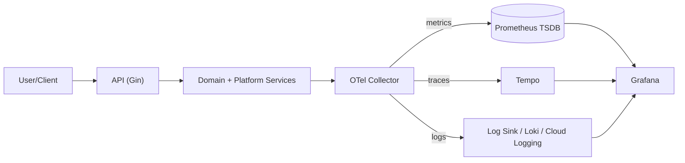

```mermaid
flowchart LR
  U[User/Client] --> G["API (Gin)"]
  G --> S["Domain + Platform Services"]
  S --> OC["OTel Collector"]

  %% Signal fan-out
  OC -->|metrics| P[(Prometheus TSDB)]
  OC -->|traces| Te["Tempo"]
  OC -->|logs| Lo["Log Sink / Loki / Cloud Logging"]

  %% Visualization
  P --> Gr[Grafana]
  Te --> Gr
  Lo --> Gr
```
