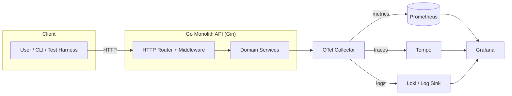
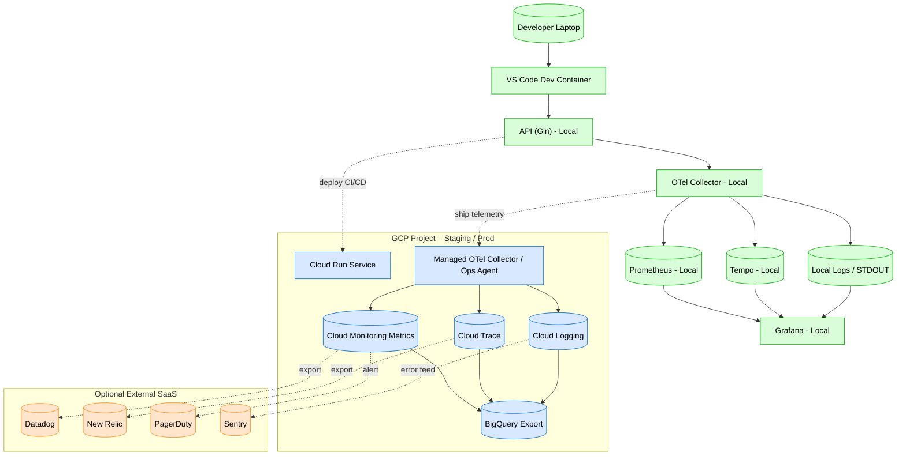
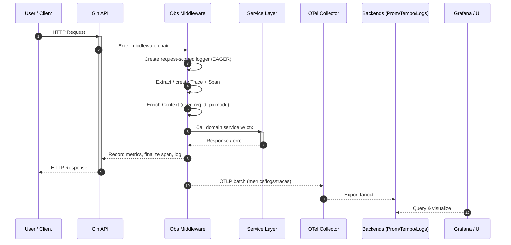

# Architecture Overview

This document provides the **end‑to‑end high‑level system view** for the Go Observability Mastery reference implementation. It shows the *runtime data plane* (requests flowing through the app) and the *telemetry control plane* (signals exported to the observability stack).

---

## 1. High‑Level Runtime + Telemetry (Compact)

---

## 2. Expanded – With Local vs Cloud Personas

---

## 3. Environment Swimlane – Request + Telemetry Path

---

## 4. Data Plane vs Telemetry Plane

Your production deployment separates *user‑facing traffic* from *observability egress*. Telemetry exporters should be non‑blocking; backpressure / retries handled in the Collector layer; metric cardinality enforced at instrumentation time.

---

## 5. Trace‑Log Correlation Points

1. **Request ID** generated at ingress (fallback).  
2. **Trace & Span IDs** injected into logger fields in middleware.  
3. **Error Observation Point** ensures *single* metrics increment + span error + structured log.  
4. **User Hash / Pseudonym** optional (compliance mode).  

---

See also: `request-lifecycle.md` for a line‑by‑line breakdown of middleware enrichment.
