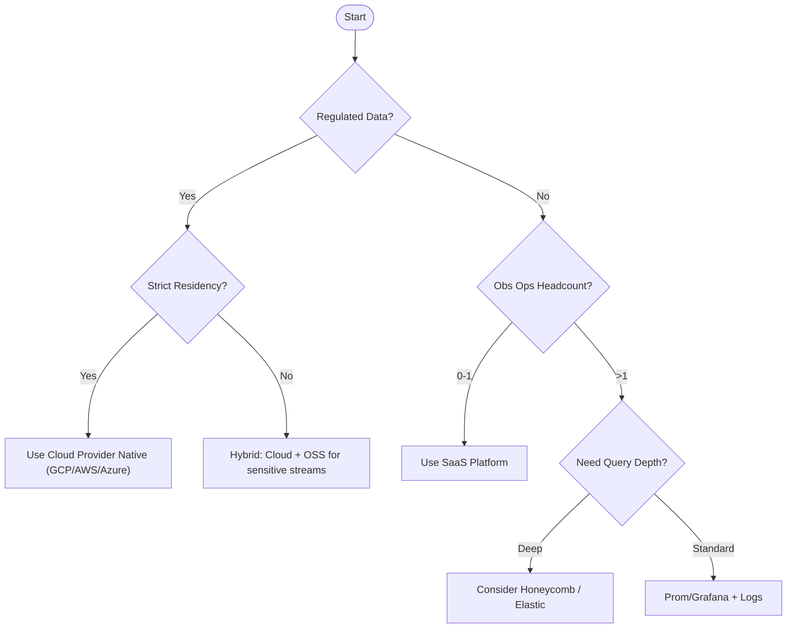

# Observability Decision Matrix

Use this worksheet when deciding whether to **stay OSS‑local**, **adopt managed cloud services**, or **standardize on a SaaS observability platform**.

---

## 1. Scoring Dimensions

| Dimension | Weight | Description |
|-----------|--------|-------------|
| Time‑to‑Value | 5 | How fast to onboard new teams? |
| Cost Predictability | 4 | Are we charged by data volume / host / span? |
| Data Residency / Compliance | 5 | Can data stay in region? |
| Ecosystem Fit | 3 | SDKs & exporters for our langs? |
| Cardinality Cost | 4 | Pricing blowups on high-card metrics/logs? |
| Query Power | 3 | Can we do ad‑hoc, long‑tail debugging? |
| Lock‑in Risk | 5 | How hard to migrate away? |

---

## 2. Printable Score Sheet

```text
Platform: _____________________________

Score each 1-5 (5 = strong alignment)

[ ] Time-to-Value: ___
[ ] Cost Predictability: ___
[ ] Compliance: ___
[ ] Ecosystem Fit: ___
[ ] Cardinality Cost: ___
[ ] Query Power: ___
[ ] Lock-in Risk (invert: 5=low risk): ___

Weighted Total = Σ(score * weight) / Σ(weights)
```

---

## 3. Quick Guidance by Phase Size

| Org Stage | Monthly Spend Target | Recommended Stack | Rationale |
|-----------|--------------------|-------------------|-----------|
| Solo / Learning | <$100 | Local OSS (Prom/Grafana/Tempo) | Free + hands‑on learning |
| Small Team (<5 svc) | <$1K | Cloud Native (GCP Ops / AWS CloudWatch) | Integrated & low op burden |
| Scale‑Up | $1K‑$10K | Hybrid: Cloud metrics + SaaS logs | Logs are $ driver; optimize |
| Enterprise | $10K+ | Consolidated SaaS (Datadog / New Relic) | Org‑wide visibility, governance |

---

## 4. Decision Tree



---

## 5. When to Standardize on GCP Operations Suite

Choose GCP Ops Suite when:  
- Majority of infra already in GCP.  
- Need IAM‑governed access to logs/metrics.  
- Want auto‑collection from Cloud Run / GKE / PubSub / BigQuery.  
- Prefer managed uptime checks & SLO burn‑rate alerts.  

See vendor-landscape.md for details.


---
