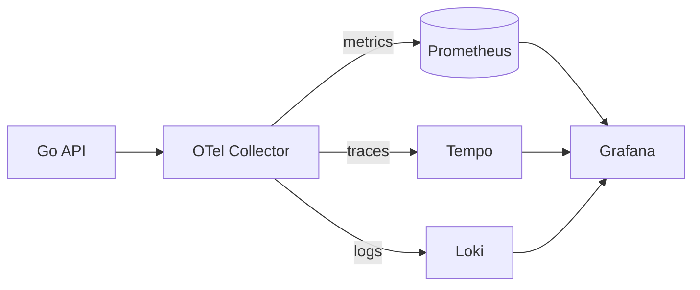
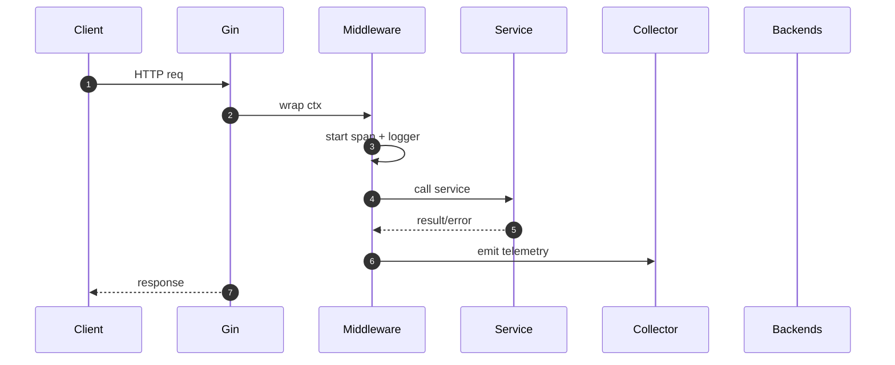
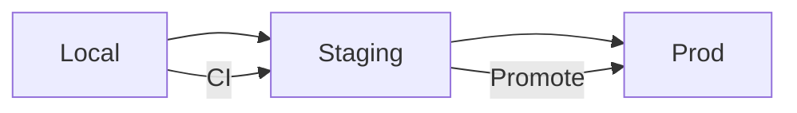

# Mermaid Snippets Library

Copy/paste blocks below into READMEs, PRs, or Slack conversations. All have been validated in GitHub Markdown preview.

---

## Compact Signals Fanout

---

## Request Lifecycle Sequence

---

## Env Split Mini

---

If you discover a snippet that breaks GitHub rendering, open an issue and paste the failing snippet so we can patch it.

---
