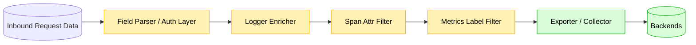

# PII Safety Layers

Observability frequently leaks personal data. This doc defines **data classes**, **allowed exposure modes**, **redaction responsibilities**, and **runtime controls** that apply across all services that adopt the Go Observability Mastery stack.

---

## 1. Data Classification Matrix

| Class | Examples | Allowed in Logs | Allowed in Metrics | Allowed in Traces | Notes |
|-------|----------|----------------|--------------------|-------------------|-------|
| **Class 0 (Safe)** | http method, route template, status class | ✅ | ✅ | ✅ | Always OK |
| **Class 1 (Low Sensitivity)** | hashed user id, feature flag name, tier | ✅ (masked) | ✅ (enum label) | ✅ | Hash or enum only |
| **Class 2 (Moderate)** | email domain, org name | ✅ (domain only) | ⚠️ (enum whitelist) | ✅ (attr redacted) | No full email |
| **Class 3 (High)** | full email, IP, internal ids | ❌ (unless debug+dev) | ❌ | ⚠️ (redacted in attr) | Allowed only in secured trace attrs |
| **Class 4 (Restricted)** | PII/PHI/PCI: SSN, CC#, DOB | ❌ | ❌ | ❌ | Strip at ingress |

---

## 2. Runtime PII Modes

| Mode | Logging Behavior | Trace Attr Behavior | Default Env |
|------|------------------|--------------------|-------------|
| `full` | full user ids, emails | full | *local only* |
| `redact` | user hash, email domain only | hashed | *staging* |
| `none` | no user fields recorded | none | *production high compliance* |

---

## 3. Data Flow Redaction Points

---

## 4. Security Controls

- Redaction functions unit‑tested w/ golden samples.
- CI fails if `PII_GUARD=on` + grep finds email regex in log fixtures.
- Metrics interface *never* accepts raw user input for labels.
- Span attribute helper auto‑hashes when env != dev.

---

## 5. Integration With Cloud DLP (Optional)

For regulated industries, integrate GCP Cloud DLP or 3rd‑party scanning on archived logs; automatically redact matched findings. See `decision-matrix.md` for when to adopt managed DLP.

---
