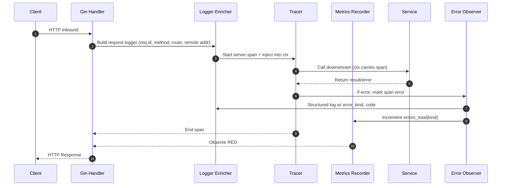

# Request Lifecycle Cheat Sheet

This doc ties code to diagrams: exactly *what happens where* in the observability middleware chain.

---

## 1. Lifecycle Diagram (Middleware Focus)

---

## 2. Instrumentation Checklist

- [ ] Use `context.Context` on every call path.
- [ ] At ingress, create **request‑scoped logger** (EAGER pattern).
- [ ] Inject **trace_id** + **span_id** into logger fields.
- [ ] Template the route (`/users/{id}`) before recording metrics.
- [ ] Convert status to class (`2xx`,`4xx`...).  
- [ ] Record duration histograms **after** response written.
- [ ] Observe errors *once* (middleware).

---

## 3. Code Hook Map

| Layer | Function | Obs Hook | Package |
|-------|----------|----------|---------|
| Gin Middleware | `LoggerMiddleware` | EAGER enrichment | `internal/api/middleware` |
| Gin Middleware | `TracingMiddleware` | Root span create | same |
| Gin Middleware | `MetricsMiddleware` | RED, cardinality | same |
| Gin Middleware | `ErrorHandlerMiddleware` | Single observation | same |
| Domain Service | Business logs | `log.LoggerFromContext` |
| Domain Service | Span child | `tracer.Start` |
| Repo / External | DB span, error wrap | repo pkg |

---

## 4. Performance Guardrails

- Avoid allocating new loggers per sub‑call.
- Use pre‑allocated arg slices (pool) in hot paths.
- Log at `debug` only in dev.
- Use sampling logger for noisy paths.

See performance dashboards in Grafana for validation.

