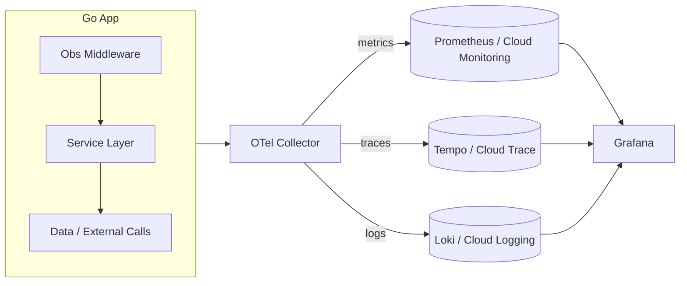
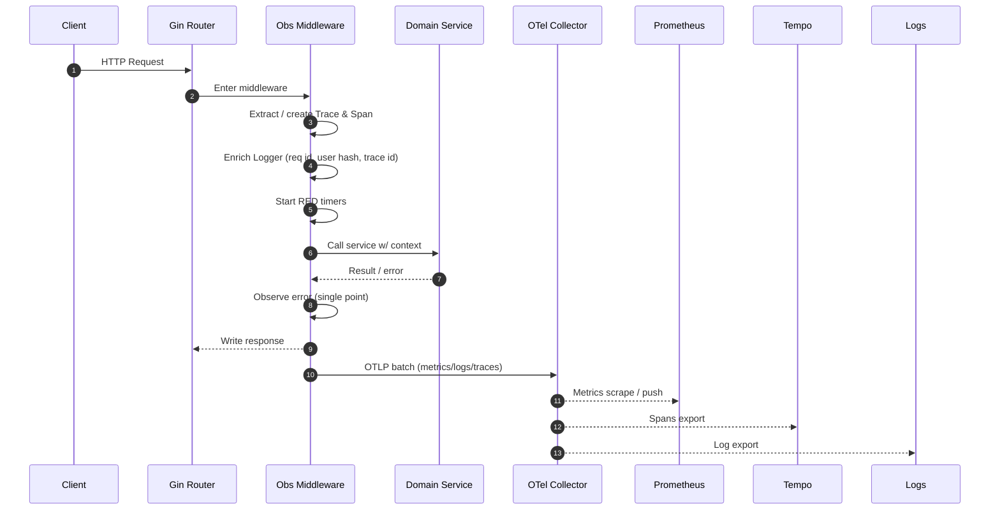

# Telemetry Signal Flow

This doc shows how each telemetry signal originates in code, moves through middleware, and lands in its storage backend. Use it when instrumenting *new* features.

---

## 1. Unified Signal Fanout (Context‑First)

---

## 2. Request Lifecycle With Signal Hooks

---

## 3. Source‑of‑Truth Table

| Signal | Generated Where | Transport | Backend | Query Tool | Retention | Notes |
|--------|----------------|-----------|---------|------------|-----------|-------|
| **Logs** | Middleware + domain services via `log.Logger` | stdout → Collector | Loki / Cloud Logging | Grafana Logs / GCP Logs Explorer | 7d dev / 30d prod | PII redaction |
| **Metrics** | Middleware (RED), domain (business) | scrape (Prom), OTLP (Cloud) | Prometheus / GCM | Grafana / Cloud Metrics Explorer | 14d dev / 13mo prod (rollup) | Cardinality budget |
| **Traces** | Middleware span root + service spans | OTLP HTTP | Tempo / Cloud Trace | Tempo UI / GCP Trace | 3d dev / 7d prod | Sampling active |

---

## 4. Error Correlation Hook Points

- Structured error created in domain (`AppError`)
- Returned up stack; *not* logged in leaf functions
- Observed once in middleware: span error + log + metrics counter increment
- Error code ↔ HTTP status ↔ alert routing

---

See `request-lifecycle.md` for code‑level instrumentation patterns.
