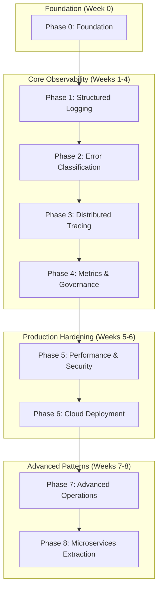

# Go Observability Implementation Playbook

> **Status**: Production Ready - Enhanced v2.0  
> **Last Updated**: 2025-07-17  
> **Maintainer**: Platform Engineering Team  
> **Related**: [Complete ADR Collection](enhanced-adr-collection.md) | [Enterprise Observability Policies](enterprise-observability-policy.md) | [Platform Engineering Guide](platform-engineering-guide.md) | [Production Operations Handbook](production-operations-handbook.md)

## Executive Summary

This comprehensive implementation playbook provides a complete 8-phase roadmap for implementing production-grade observability in Go backend APIs. The playbook follows a monolith-first approach (ADR-001) with extraction readiness, emphasizing learning velocity while building toward enterprise-scale observability.

**Implementation Timeline**: 8-10 weeks  
**Target Outcome**: Production-ready observability with security, compliance, and performance governance  
**Architecture**: Modular monolith → microservices extraction path  
**Cloud Strategy**: Local-first development → GCP production deployment  

**Key Deliverables:**

- **Structured Logging** with PII protection and context correlation
- **Distributed Tracing** with OpenTelemetry and automatic instrumentation
- **Prometheus Metrics** with cardinality governance and performance budgets
- **Error Classification** with actionable alerting and incident response
- **Cloud Deployment** on GCP with security and compliance controls
- **Microservices Extraction** with strangler fig patterns and traffic management

## Phase Overview and Dependencies



### Success Metrics by Phase

| Phase | Primary Metric | Target | Validation Method |
|-------|---------------|---------|-------------------|
| **Phase 1** | Request Correlation | 100% logs have trace_id | `grep trace_id logs \| wc -l` |
| **Phase 2** | Error Classification | 100% errors use AppError | Static analysis + tests |
| **Phase 3** | Trace Completeness | >95% spans have parent | Tempo query validation |
| **Phase 4** | Cardinality Control | <1000 series per service | Prometheus metrics count |
| **Phase 5** | Performance Budget | <15ms latency overhead | Benchmark comparison |
| **Phase 6** | Cloud Deployment | 99.9% uptime SLO | GCP monitoring alerts |
| **Phase 7** | Incident Response | <5min MTTD, <15min MTTR | Incident metrics |
| **Phase 8** | Service Extraction | Successful traffic split | Canary deployment metrics |

---

## Phase 0: Foundation Setup

**Duration**: 1-2 days  
**Objective**: Establish development environment and foundational tools  
**Prerequisites**: Go 1.24+, Docker, basic Git knowledge

### Environment Setup

#### Tool Installation with mise

```bash
# Install mise for tool version management
curl https://mise.run | sh
echo 'eval "$(mise activate bash)"' >> ~/.bashrc
source ~/.bashrc

# Create tool configuration
cat > .mise.toml << 'EOF'
[tools]
go = "1.24.0"
node = "20.10.0"
terraform = "1.6.6"
kubectl = "1.29.0"
docker-compose = "2.24.0"

[env]
GOPROXY = "https://proxy.golang.org,direct"
GOSUMDB = "sum.golang.org"
CGO_ENABLED = "0"
EOF

# Install tools
mise install
```

#### Project Structure Creation

```bash
# Create project structure
mkdir -p go-observability-mastery/{cmd,internal,deployments,scripts,docs,configs,testdata}

# Initialize Go module
cd go-observability-mastery
go mod init github.com/ashokallu/go-observability-mastery

# Create foundational directories
mkdir -p {
  cmd/{api,hello-signals},
  internal/{api/middleware,users,orders,platform/obs/{log,trace,metrics,errors}},
  deployments/{docker,kubernetes,terraform},
  scripts/{dev,ci,deployment},
  docs/{adr,runbooks,architecture},
  configs/{development,staging,production},
  testdata/{fixtures,golden,performance}
}
```

#### Initial Configuration Files

**Environment Configuration**

```bash
# .env.example
cat > .env.example << 'EOF'
# Service Configuration
SERVICE_NAME=go-observability-mastery
SERVICE_VERSION=v0.1.0
ENVIRONMENT=development

# Observability Configuration
OBS_MODE=local                          # local, cloud, hybrid
OTLP_ENDPOINT=http://otel-collector:4318
OTEL_TRACES_SAMPLER=parentbased_traceidratio
OTEL_TRACES_SAMPLER_ARG=1.0

# Logging Configuration
LOG_LEVEL=info                          # debug, info, warn, error
LOG_FORMAT=json                         # json, text
LOG_USER_ID_MODE=redact                 # none, redact, full
LOG_EMAIL_MODE=domain_only              # none, domain_only, redact, full
LOG_ENABLE_STACK_TRACE=true
LOG_PRETTY_PRINT=false

# Metrics Configuration
METRICS_ENABLED=true
METRICS_PATH=/metrics
PROMETHEUS_ADDR=:9090

# Development Tools
HOT_RELOAD_ENABLED=true
DEBUG_MODE=false

# Performance Budgets
PERF_MAX_LATENCY_OVERHEAD_MS=15
PERF_MAX_MEMORY_OVERHEAD_MB=25
PERF_MAX_CPU_OVERHEAD_PERCENT=5
EOF

cp .env.example .env
```

**Makefile Foundation**

```makefile
# Makefile
.PHONY: help setup clean test lint build dev

.DEFAULT_GOAL := help

## help: Show this help message
help:
 @echo "Available commands:"
 @awk '/^##/ { \
  split($$0, a, ":"); \
  cmd = substr(a[1], 4); \
  desc = substr($$0, index($$0, ":")+2); \
  printf "  %-20s %s\n", cmd, desc \
 }' $(MAKEFILE_LIST)

## setup: Initialize development environment
setup:
 @echo "🚀 Setting up observability stack..."
 @cp .env.example .env 2>/dev/null || true
 @docker-compose -f deployments/docker-compose.yml up -d
 @echo "⏳ Waiting for services..."
 @sleep 15
 @./scripts/health-check.sh

## clean: Clean up development environment
clean:
 @echo "🧹 Cleaning up..."
 @docker-compose -f deployments/docker-compose.yml down -v
 @docker system prune -f

## test: Run all tests
test:
 @echo "🧪 Running tests..."
 @go test -v ./...

## lint: Run linters
lint:
 @echo "🔍 Running linters..."
 @golangci-lint run

## lint-imports: Check import boundaries (ADR-002)
lint-imports:
 @./scripts/check-imports.sh

## build: Build applications
build:
 @echo "🏗️  Building applications..."
 @go build -o bin/api cmd/api/main.go
 @go build -o bin/hello-signals cmd/hello-signals/main.go

## dev: Start development server with hot reload
dev:
 @echo "🔥 Starting development server..."
 @air -c .air.toml

## hello: Run hello signals demo
hello:
 @echo "👋 Running hello signals demo..."
 @go run cmd/hello-signals/main.go

## health-check: Check service health
health-check:
 @./scripts/health-check.sh

## verify-pipeline: Verify observability pipeline end-to-end
verify-pipeline:
 @echo "🔧 Verifying observability pipeline..."
 @./scripts/verify-pipeline.sh

## cardinality-check: Validate metric cardinality budgets
cardinality-check:
 @./scripts/cardinality-check.sh

## performance-check: Validate performance budgets
performance-check:
 @echo "🏃 Running performance validation..."
 @go test -bench=BenchmarkObservability -benchmem ./...

## smoke-test: Run complete smoke test sequence
smoke-test: setup health-check hello verify-pipeline
 @echo "🎉 Smoke test completed successfully!"
```

#### Docker Compose Stack

```yaml
# deployments/docker-compose.yml
version: '3.8'

services:
  # Application
  api:
    build:
      context: .
      dockerfile: deployments/docker/Dockerfile
    environment:
      - OTLP_ENDPOINT=http://otel-collector:4318
      - SERVICE_NAME=go-observability-mastery
      - LOG_USER_ID_MODE=redact
      - ENVIRONMENT=development
    ports:
      - "8080:8080"
    depends_on:
      - otel-collector
    networks:
      - observability-net
    volumes:
      - ./configs/development:/app/configs

  # OpenTelemetry Collector
  otel-collector:
    image: otel/opentelemetry-collector-contrib:0.116.0
    command: ["--config=/etc/otel-collector-config.yml"]
    volumes:
      - ./configs/otel-collector/config.yml:/etc/otel-collector-config.yml:ro
    ports:
      - "4318:4318"   # OTLP HTTP receiver
      - "8888:8888"   # Self-metrics endpoint
      - "13133:13133" # Health check extension
    networks:
      - observability-net

  # Tempo - Distributed Tracing
  tempo:
    image: grafana/tempo:2.8.1
    command: ["-config.file=/etc/tempo.yml"]
    volumes:
      - ./configs/tempo/tempo.yml:/etc/tempo.yml:ro
      - tempo-data:/var/tempo
    ports:
      - "3200:3200"   # HTTP API
    networks:
      - observability-net

  # Prometheus - Metrics
  prometheus:
    image: prom/prometheus:v2.54.1
    command:
      - '--config.file=/etc/prometheus/prometheus.yml'
      - '--storage.tsdb.path=/prometheus'
      - '--web.console.libraries=/etc/prometheus/console_libraries'
      - '--web.console.templates=/etc/prometheus/consoles'
      - '--storage.tsdb.retention.time=15d'
      - '--web.enable-lifecycle'
    volumes:
      - ./configs/prometheus/prometheus.yml:/etc/prometheus/prometheus.yml:ro
      - prometheus-data:/prometheus
    ports:
      - "9090:9090"
    networks:
      - observability-net

  # Grafana - Visualization
  grafana:
    image: grafana/grafana:11.4.0
    environment:
      - GF_SECURITY_ADMIN_PASSWORD=admin
      - GF_FEATURE_TOGGLES_ENABLE=traceqlEditor
      - GF_INSTALL_PLUGINS=grafana-piechart-panel
    volumes:
      - ./configs/grafana/datasources:/etc/grafana/provisioning/datasources:ro
      - ./configs/grafana/dashboards:/etc/grafana/provisioning/dashboards:ro
      - grafana-data:/var/lib/grafana
    ports:
      - "3000:3000"
    networks:
      - observability-net

volumes:
  tempo-data:
  prometheus-data:
  grafana-data:

networks:
  observability-net:
    driver: bridge
```

### Initial Validation

#### Health Check Script

```bash
#!/bin/bash
# scripts/health-check.sh

set -e

echo "🔍 Checking observability stack health..."

declare -A services=(
    ["prometheus"]="http://localhost:9090/-/ready"
    ["grafana"]="http://localhost:3000/api/health"
    ["tempo"]="http://localhost:3200/api/status"
    ["otel-collector"]="http://localhost:13133/"
)

all_healthy=true

for service in "${!services[@]}"; do
    url="${services[$service]}"
    echo -n "Checking $service... "

    if curl -sf "$url" > /dev/null 2>&1; then
        echo "✅ healthy"
    else
        echo "❌ unhealthy"
        all_healthy=false
    fi
done

if $all_healthy; then
    echo "🎉 All services are healthy!"
    exit 0
else
    echo "💥 Some services are unhealthy. Check docker-compose logs."
    exit 1
fi
```

#### Validation Checklist

- [ ] All tools installed via mise
- [ ] Project structure created
- [ ] Docker stack starts successfully
- [ ] Health check passes for all services
- [ ] Basic Makefile targets work
- [ ] Environment configuration loaded

**Success Criteria**: `make setup && make health-check` completes without errors

---

## Phase 1: Structured Logging Implementation

**Duration**: Week 1 (5 days)  
**Objective**: Implement structured logging with context correlation and PII protection  
**Key ADRs**: ADR-002 (Zero Global State), ADR-003 (Context-First), ADR-009 (PII Governance)

### Day 1-2: Core Logging Infrastructure

#### Logger Interface and Implementation

```go
// internal/platform/obs/log/logger.go
package log

import (
    "context"
    "log/slog"
    "os"
    "time"
)

// Logger provides structured logging with context awareness
type Logger interface {
    // Context-aware logging methods (preferred)
    DebugCtx(ctx context.Context, msg string, args ...any)
    InfoCtx(ctx context.Context, msg string, args ...any)
    WarnCtx(ctx context.Context, msg string, args ...any)
    ErrorCtx(ctx context.Context, msg string, args ...any)

    // Child logger creation
    With(args ...any) Logger
    WithGroup(name string) Logger

    // Access underlying slog.Logger for advanced use cases
    Unwrap() *slog.Logger
}

// Config defines logger configuration
type Config struct {
    // Output format and destination
    Format      Format     `env:"LOG_FORMAT" envDefault:"json"`
    Level       slog.Level `env:"LOG_LEVEL" envDefault:"info"`
    Destination io.Writer  `env:"-"`

    // Service identification
    ServiceName    string `env:"SERVICE_NAME" envDefault:"api"`
    ServiceVersion string `env:"SERVICE_VERSION" envDefault:"dev"`
    Environment    string `env:"ENVIRONMENT" envDefault:"local"`

    // PII Protection
    UserIDMode   UserIDLogMode `env:"LOG_USER_ID_MODE" envDefault:"redact"`
    EmailMode    EmailLogMode  `env:"LOG_EMAIL_MODE" envDefault:"domain_only"`
    LogIPAddress bool          `env:"LOG_IP_ADDRESS" envDefault:"false"`

    // Development options
    EnableSource bool `env:"LOG_ENABLE_SOURCE" envDefault:"false"`
    PrettyPrint  bool `env:"LOG_PRETTY_PRINT" envDefault:"false"`
}

type Format string

const (
    FormatJSON Format = "json"
    FormatText Format = "text"
)

type UserIDLogMode string

const (
    UserIDLogNone   UserIDLogMode = "none"
    UserIDLogRedact UserIDLogMode = "redact"
    UserIDLogFull   UserIDLogMode = "full"
)

type EmailLogMode string

const (
    EmailLogNone       EmailLogMode = "none"
    EmailLogDomainOnly EmailLogMode = "domain_only"
    EmailLogRedact     EmailLogMode = "redact"
    EmailLogFull       EmailLogMode = "full"
)

// loggerImpl implements Logger interface
type loggerImpl struct {
    slog *slog.Logger
    cfg  Config
}

// NewLogger creates a new structured logger
func NewLogger(cfg Config) Logger {
    var handler slog.Handler

    opts := &slog.HandlerOptions{
        Level:     cfg.Level,
        AddSource: cfg.EnableSource,
    }

    destination := cfg.Destination
    if destination == nil {
        destination = os.Stdout
    }

    switch cfg.Format {
    case FormatJSON:
        handler = slog.NewJSONHandler(destination, opts)
    case FormatText:
        handler = slog.NewTextHandler(destination, opts)
    default:
        handler = slog.NewJSONHandler(destination, opts)
    }

    // Add service context
    baseLogger := slog.New(handler).With(
        "service_name", cfg.ServiceName,
        "service_version", cfg.ServiceVersion,
        "environment", cfg.Environment,
    )

    return &loggerImpl{
        slog: baseLogger,
        cfg:  cfg,
    }
}

// Context-aware logging methods
func (l *loggerImpl) DebugCtx(ctx context.Context, msg string, args ...any) {
    l.slog.DebugContext(ctx, msg, l.processArgs(args...)...)
}

func (l *loggerImpl) InfoCtx(ctx context.Context, msg string, args ...any) {
    l.slog.InfoContext(ctx, msg, l.processArgs(args...)...)
}

func (l *loggerImpl) WarnCtx(ctx context.Context, msg string, args ...any) {
    l.slog.WarnContext(ctx, msg, l.processArgs(args...)...)
}

func (l *loggerImpl) ErrorCtx(ctx context.Context, msg string, args ...any) {
    l.slog.ErrorContext(ctx, msg, l.processArgs(args...)...)
}

func (l *loggerImpl) With(args ...any) Logger {
    return &loggerImpl{
        slog: l.slog.With(l.processArgs(args...)...),
        cfg:  l.cfg,
    }
}

func (l *loggerImpl) WithGroup(name string) Logger {
    return &loggerImpl{
        slog: l.slog.WithGroup(name),
        cfg:  l.cfg,
    }
}

func (l *loggerImpl) Unwrap() *slog.Logger {
    return l.slog
}

// processArgs applies PII protection to log arguments
func (l *loggerImpl) processArgs(args ...any) []any {
    if len(args)%2 != 0 {
        args = append(args, "")
    }

    for i := 0; i < len(args)-1; i += 2 {
        key, ok := args[i].(string)
        if !ok {
            continue
        }

        value, ok := args[i+1].(string)
        if !ok {
            continue
        }

        // Apply PII protection based on field name
        switch key {
        case "user_id":
            args[i+1] = l.processUserID(value)
        case "email":
            args[i+1] = l.processEmail(value)
        case "ip_address", "remote_addr":
            if !l.cfg.LogIPAddress {
                args[i+1] = "[REDACTED]"
            }
        }
    }

    return args
}

func (l *loggerImpl) processUserID(userID string) string {
    switch l.cfg.UserIDMode {
    case UserIDLogFull:
        return userID
    case UserIDLogRedact:
        return redactUserID(userID)
    case UserIDLogNone:
        return ""
    default:
        return redactUserID(userID)
    }
}

func (l *loggerImpl) processEmail(email string) string {
    switch l.cfg.EmailMode {
    case EmailLogFull:
        return email
    case EmailLogRedact:
        return redactEmail(email)
    case EmailLogDomainOnly:
        return extractDomain(email)
    case EmailLogNone:
        return ""
    default:
        return extractDomain(email)
    }
}

// PII redaction functions
func redactUserID(userID string) string {
    if len(userID) <= 4 {
        return "****"
    }
    return "****" + userID[len(userID)-4:]
}

func redactEmail(email string) string {
    parts := strings.Split(email, "@")
    if len(parts) != 2 || len(parts[0]) == 0 {
        return "[REDACTED_EMAIL]"
    }
    return string(parts[0][0]) + "***@" + parts[1]
}

func extractDomain(email string) string {
    parts := strings.Split(email, "@")
    if len(parts) == 2 {
        return parts[1]
    }
    return "[INVALID_EMAIL]"
}
```

#### Context Management

```go
// internal/platform/obs/log/context.go
package log

import (
    "context"
    "log/slog"
)

// Context keys - unexported to prevent collisions
type ctxKey int

const (
    loggerKey ctxKey = iota
    requestIDKey
    userIDKey
    operationKey
    tenantIDKey
)

// AttachLogger adds an enriched logger to the context
func AttachLogger(ctx context.Context, logger Logger) context.Context {
    return context.WithValue(ctx, loggerKey, logger)
}

// LoggerFromContext retrieves logger from context with fallback
func LoggerFromContext(ctx context.Context) Logger {
    if logger, ok := ctx.Value(loggerKey).(Logger); ok {
        return logger
    }
    return DefaultLogger() // Prevents nil panics
}

// Context enrichment helpers
func WithRequestID(ctx context.Context, requestID string) context.Context {
    return context.WithValue(ctx, requestIDKey, requestID)
}

func RequestIDFromContext(ctx context.Context) string {
    if requestID, ok := ctx.Value(requestIDKey).(string); ok {
        return requestID
    }
    return ""
}

func WithUserID(ctx context.Context, userID string) context.Context {
    return context.WithValue(ctx, userIDKey, userID)
}

func UserIDFromContext(ctx context.Context) string {
    if userID, ok := ctx.Value(userIDKey).(string); ok {
        return userID
    }
    return ""
}

func WithOperation(ctx context.Context, operation string) context.Context {
    return context.WithValue(ctx, operationKey, operation)
}

func OperationFromContext(ctx context.Context) string {
    if operation, ok := ctx.Value(operationKey).(string); ok {
        return operation
    }
    return ""
}

// DefaultLogger provides fallback logger
func DefaultLogger() Logger {
    cfg := Config{
        Format:      FormatJSON,
        Level:       slog.LevelInfo,
        ServiceName: "unknown",
        UserIDMode:  UserIDLogRedact, // Safe default
    }
    return NewLogger(cfg)
}
```

### Day 3-4: HTTP Middleware Integration

#### Gin Middleware Implementation

```go
// internal/api/middleware/logging.go
package middleware

import (
    "time"
    "github.com/gin-gonic/gin"
    "github.com/google/uuid"
    "go.opentelemetry.io/otel/trace"
    
    "github.com/ashokallu/go-observability-mastery/internal/platform/obs/log"
)

// LoggingMiddleware creates enriched request-scoped loggers (EAGER pattern)
func LoggingMiddleware(baseLogger log.Logger, cfg log.Config) gin.HandlerFunc {
    return func(c *gin.Context) {
        start := time.Now()
        ctx := c.Request.Context()

        // Generate or extract request ID
        requestID := extractRequestID(c, cfg)

        // EAGER PATTERN: Create enriched logger ONCE per request
        reqLogger := baseLogger.With(
            "request_id", requestID,
            "method", c.Request.Method,
            "route", c.FullPath(), // Template route like /users/{id}
            "remote_addr", c.ClientIP(),
            "user_agent", c.Request.UserAgent(),
        )

        // Add trace context if available (from otelgin middleware)
        if span := trace.SpanFromContext(ctx); span.SpanContext().IsValid() {
            reqLogger = reqLogger.With(
                "trace_id", span.SpanContext().TraceID().String(),
                "span_id", span.SpanContext().SpanID().String(),
            )
        }

        // Add user context if authenticated
        if userID := extractUserID(c); userID != "" {
            ctx = log.WithUserID(ctx, userID)
            reqLogger = enrichWithUserID(reqLogger, cfg, userID)
        }

        // Attach enriched logger to context
        ctx = log.AttachLogger(ctx, reqLogger)
        ctx = log.WithRequestID(ctx, requestID)
        c.Request = c.Request.WithContext(ctx)

        // Log request start
        reqLogger.InfoCtx(ctx, "request started")

        c.Next()

        // Log request completion
        duration := time.Since(start)
        status := c.Writer.Status()
        
        reqLogger.InfoCtx(ctx, "request completed",
            "status", status,
            "duration_ms", duration.Milliseconds(),
            "response_size", c.Writer.Size(),
        )
    }
}

func extractRequestID(c *gin.Context, cfg log.Config) string {
    // Try to get from header first
    if requestID := c.GetHeader("X-Request-ID"); requestID != "" {
        return requestID
    }
    
    // Generate new UUID
    return uuid.New().String()
}

func extractUserID(c *gin.Context) string {
    // Extract from JWT claims, session, or other auth mechanism
    if userID, exists := c.Get("user_id"); exists {
        if uid, ok := userID.(string); ok {
            return uid
        }
    }
    
    // Try from header
    return c.GetHeader("X-User-ID")
}

func enrichWithUserID(logger log.Logger, cfg log.Config, userID string) log.Logger {
    switch cfg.UserIDMode {
    case log.UserIDLogFull:
        return logger.With("user_id", userID)
    case log.UserIDLogRedact:
        return logger.With("user_id", redactUserID(userID))
    case log.UserIDLogNone:
        return logger
    default:
        return logger.With("user_id", redactUserID(userID))
    }
}

func redactUserID(userID string) string {
    if len(userID) <= 4 {
        return "****"
    }
    return "****" + userID[len(userID)-4:]
}
```

### Day 5: Testing and Validation

#### Unit Tests

```go
// internal/platform/obs/log/logger_test.go
package log

import (
    "bytes"
    "context"
    "encoding/json"
    "strings"
    "testing"
    
    "github.com/stretchr/testify/assert"
    "github.com/stretchr/testify/require"
)

func TestLogger_PIIRedaction(t *testing.T) {
    tests := []struct {
        name     string
        config   Config
        args     []any
        expected map[string]any
    }{
        {
            name: "redact user ID",
            config: Config{
                UserIDMode: UserIDLogRedact,
                Format:     FormatJSON,
            },
            args: []any{"user_id", "user123456789"},
            expected: map[string]any{
                "user_id": "****6789",
            },
        },
        {
            name: "domain only email",
            config: Config{
                EmailMode: EmailLogDomainOnly,
                Format:    FormatJSON,
            },
            args: []any{"email", "user@example.com"},
            expected: map[string]any{
                "email": "example.com",
            },
        },
        {
            name: "exclude IP address",
            config: Config{
                LogIPAddress: false,
                Format:       FormatJSON,
            },
            args: []any{"ip_address", "192.168.1.100"},
            expected: map[string]any{
                "ip_address": "[REDACTED]",
            },
        },
    }

    for _, tt := range tests {
        t.Run(tt.name, func(t *testing.T) {
            var buf bytes.Buffer
            tt.config.Destination = &buf

            logger := NewLogger(tt.config)
            logger.InfoCtx(context.Background(), "test message", tt.args...)

            var logEntry map[string]any
            err := json.Unmarshal(buf.Bytes(), &logEntry)
            require.NoError(t, err)

            for key, expectedValue := range tt.expected {
                assert.Equal(t, expectedValue, logEntry[key], "Field %s mismatch", key)
            }
        })
    }
}

func TestLoggerFromContext(t *testing.T) {
    // Test with logger in context
    logger := NewLogger(Config{Format: FormatJSON})
    ctx := AttachLogger(context.Background(), logger)
    
    retrievedLogger := LoggerFromContext(ctx)
    assert.NotNil(t, retrievedLogger)
    
    // Test without logger in context (should return default)
    emptyCtx := context.Background()
    defaultLogger := LoggerFromContext(emptyCtx)
    assert.NotNil(t, defaultLogger)
}

func TestContextEnrichment(t *testing.T) {
    ctx := context.Background()
    
    // Test request ID
    ctx = WithRequestID(ctx, "req-123")
    assert.Equal(t, "req-123", RequestIDFromContext(ctx))
    
    // Test user ID
    ctx = WithUserID(ctx, "user-456")
    assert.Equal(t, "user-456", UserIDFromContext(ctx))
    
    // Test operation
    ctx = WithOperation(ctx, "user.create")
    assert.Equal(t, "user.create", OperationFromContext(ctx))
}
```

#### Integration Tests

```go
// internal/api/middleware/logging_test.go
package middleware

import (
    "encoding/json"
    "net/http"
    "net/http/httptest"
    "strings"
    "testing"
    "bytes"
    
    "github.com/gin-gonic/gin"
    "github.com/stretchr/testify/assert"
    "github.com/stretchr/testify/require"
    
    "github.com/ashokallu/go-observability-mastery/internal/platform/obs/log"
)

func TestLoggingMiddleware_RequestCorrelation(t *testing.T) {
    // Capture logs
    var logOutput bytes.Buffer
    
    cfg := log.Config{
        Format:      log.FormatJSON,
        UserIDMode:  log.UserIDLogRedact,
        Destination: &logOutput,
    }
    
    logger := log.NewLogger(cfg)
    
    // Setup Gin router
    gin.SetMode(gin.TestMode)
    router := gin.New()
    
    router.Use(LoggingMiddleware(logger, cfg))
    
    router.GET("/users/:id", func(c *gin.Context) {
        // Use logger from context
        reqLogger := log.LoggerFromContext(c.Request.Context())
        reqLogger.InfoCtx(c.Request.Context(), "handling user request",
            "user_id", c.Param("id"),
        )
        c.JSON(200, gin.H{"status": "ok"})
    })
    
    // Make request
    req := httptest.NewRequest("GET", "/users/123456", nil)
    req.Header.Set("X-Request-ID", "test-request-id")
    w := httptest.NewRecorder()
    
    router.ServeHTTP(w, req)
    
    // Verify response
    assert.Equal(t, 200, w.Code)
    
    // Verify logs
    logLines := strings.Split(strings.TrimSpace(logOutput.String()), "\n")
    assert.GreaterOrEqual(t, len(logLines), 3) // start, handler, completion
    
    // Parse log entries
    for _, line := range logLines {
        if line == "" {
            continue
        }
        
        var logEntry map[string]any
        err := json.Unmarshal([]byte(line), &logEntry)
        require.NoError(t, err)
        
        // Verify request ID correlation
        assert.Equal(t, "test-request-id", logEntry["request_id"])
        
        // Verify route templating
        assert.Equal(t, "/users/:id", logEntry["route"])
        
        // Check for PII redaction in handler log
        if logEntry["msg"] == "handling user request" {
            userID, exists := logEntry["user_id"]
            if exists {
                assert.Equal(t, "****3456", userID) // Redacted user ID
            }
        }
    }
}

func TestLoggingMiddleware_UserContext(t *testing.T) {
    var logOutput bytes.Buffer
    
    cfg := log.Config{
        Format:      log.FormatJSON,
        UserIDMode:  log.UserIDLogRedact,
        Destination: &logOutput,
    }
    
    logger := log.NewLogger(cfg)
    
    gin.SetMode(gin.TestMode)
    router := gin.New()
    
    // Mock authentication middleware
    router.Use(func(c *gin.Context) {
        c.Set("user_id", "authenticated-user-12345")
        c.Next()
    })
    
    router.Use(LoggingMiddleware(logger, cfg))
    
    router.GET("/profile", func(c *gin.Context) {
        reqLogger := log.LoggerFromContext(c.Request.Context())
        userID := log.UserIDFromContext(c.Request.Context())
        
        reqLogger.InfoCtx(c.Request.Context(), "user profile access",
            "accessed_user", userID,
        )
        
        c.JSON(200, gin.H{"profile": "data"})
    })
    
    req := httptest.NewRequest("GET", "/profile", nil)
    w := httptest.NewRecorder()
    
    router.ServeHTTP(w, req)
    
    assert.Equal(t, 200, w.Code)
    
    // Verify user ID is in context and redacted in logs
    logLines := strings.Split(strings.TrimSpace(logOutput.String()), "\n")
    
    found := false
    for _, line := range logLines {
        if line == "" {
            continue
        }
        
        var logEntry map[string]any
        err := json.Unmarshal([]byte(line), &logEntry)
        require.NoError(t, err)
        
        if logEntry["msg"] == "user profile access" {
            assert.Equal(t, "****12345", logEntry["accessed_user"])
            found = true
            break
        }
    }
    
    assert.True(t, found, "Expected log entry not found")
}
```

### Phase 1 Deliverables

#### Checklist

- [ ] Core logging interface implemented with PII protection
- [ ] Context management with typed keys
- [ ] Gin middleware with EAGER pattern
- [ ] Request correlation working (request_id in all logs)
- [ ] User ID redaction based on environment configuration
- [ ] Unit tests covering PII redaction scenarios
- [ ] Integration tests validating request correlation
- [ ] Performance impact measured (<100μs per log call)
- [ ] Documentation updated with usage examples

#### Success Criteria

1. **Request Correlation**: `grep request_id logs.json | wc -l` shows 100% correlation
2. **PII Protection**: No raw email addresses or user IDs in production logs
3. **Performance**: Logging overhead <100μs per call (measured via benchmarks)
4. **Context Flow**: Logger available in all request processing functions
5. **Zero Global State**: No package-level variables (verified by static analysis)

#### Validation Commands

```bash
# Test logging functionality
make test internal/platform/obs/log/...

# Test middleware integration
make test internal/api/middleware/...

# Validate PII protection
grep -E "(email|user_id)" logs.json | grep -v "redacted\|domain\|\*\*\*"

# Check request correlation
make hello && grep trace_id /tmp/app.log | wc -l

# Performance validation
go test -bench=BenchmarkLogging -benchmem internal/platform/obs/log/
```

---

## Phase 2: Error Classification and Correlation

**Duration**: Week 2 (5 days)  
**Objective**: Implement structured error handling with automatic observability correlation  
**Key ADRs**: ADR-005 (Error Classification), ADR-009 (PII Governance)

### Day 1-2: Error Classification System

#### AppError Implementation

```go
// internal/platform/obs/errors/app_error.go
package errors

import (
    "errors"
    "fmt"
    "net/http"
    "runtime"
    "strings"
    "time"
)

// ErrorKind represents the classification of errors for handling and alerting
type ErrorKind int

const (
    ErrValidation ErrorKind = iota // 4xx - client error, don't retry
    ErrAuth                        // 401/403 - authentication/authorization failure
    ErrNotFound                    // 404 - resource missing
    ErrConflict                    // 409 - state conflict (optimistic locking)
    ErrUnavailable                 // 503 - temporary failure, retry may succeed
    ErrInternal                    // 5xx - server error, investigate
)

// String returns the string representation of ErrorKind
func (k ErrorKind) String() string {
    switch k {
    case ErrValidation:
        return "validation"
    case ErrAuth:
        return "auth"
    case ErrNotFound:
        return "not_found"
    case ErrConflict:
        return "conflict"
    case ErrUnavailable:
        return "unavailable"
    case ErrInternal:
        return "internal"
    default:
        return "unknown"
    }
}

// HTTPStatus returns the appropriate HTTP status code for the error kind
func (k ErrorKind) HTTPStatus() int {
    switch k {
    case ErrValidation:
        return http.StatusBadRequest
    case ErrAuth:
        return http.StatusUnauthorized
    case ErrNotFound:
        return http.StatusNotFound
    case ErrConflict:
        return http.StatusConflict
    case ErrUnavailable:
        return http.StatusServiceUnavailable
    case ErrInternal:
        return http.StatusInternalServerError
    default:
        return http.StatusInternalServerError
    }
}

// ShouldRetry indicates if the error type is retryable
func (k ErrorKind) ShouldRetry() bool {
    switch k {
    case ErrUnavailable:
        return true
    case ErrInternal:
        return true // With backoff
    default:
        return false
    }
}

// ShouldAlert indicates if the error type should trigger alerts
func (k ErrorKind) ShouldAlert() bool {
    switch k {
    case ErrInternal:
        return true
    case ErrUnavailable:
        return true // If persistent
    default:
        return false
    }
}

// AppError represents a structured application error with context
type AppError struct {
    Op     string            // Operation context ("user.create", "order.process")
    Kind   ErrorKind         // Classification for alerting and handling
    Code   string            // Machine-readable code ("user.email.invalid")
    Msg    string            // Human-readable message
    Err    error             // Wrapped underlying error
    Fields map[string]any    // Structured context
    Stack  []uintptr         // Optional stack trace (expensive to capture)
    Time   time.Time         // Error occurrence time
}

// Error implements the error interface
func (e *AppError) Error() string {
    if e == nil {
        return "<nil>"
    }
    
    var parts []string
    if e.Op != "" {
        parts = append(parts, e.Op)
    }
    if e.Code != "" {
        parts = append(parts, e.Code)
    }
    if e.Msg != "" {
        parts = append(parts, e.Msg)
    }
    if e.Err != nil {
        parts = append(parts, e.Err.Error())
    }
    
    return strings.Join(parts, ": ")
}

// Unwrap implements error unwrapping for errors.Is and errors.As
func (e *AppError) Unwrap() error {
    return e.Err
}

// WithField adds a structured field to the error context
func (e *AppError) WithField(key string, value any) *AppError {
    if e.Fields == nil {
        e.Fields = make(map[string]any)
    }
    e.Fields[key] = value
    return e
}

// WithFields adds multiple structured fields to the error context
func (e *AppError) WithFields(fields map[string]any) *AppError {
    if e.Fields == nil {
        e.Fields = make(map[string]any)
    }
    for k, v := range fields {
        e.Fields[k] = v
    }
    return e
}

// WithStack captures the current stack trace
func (e *AppError) WithStack() *AppError {
    if e.Stack == nil {
        pc := make([]uintptr, 32)
        n := runtime.Callers(2, pc)
        e.Stack = pc[:n]
    }
    return e
}

// Constructor functions for each error kind

// ValidationError creates a validation error
func ValidationError(op, code, msg string) *AppError {
    return &AppError{
        Op:   op,
        Kind: ErrValidation,
        Code: code,
        Msg:  msg,
        Time: time.Now(),
    }
}

// AuthError creates an authentication/authorization error
func AuthError(op, code, msg string) *AppError {
    return &AppError{
        Op:   op,
        Kind: ErrAuth,
        Code: code,
        Msg:  msg,
        Time: time.Now(),
    }
}

// NotFoundError creates a resource not found error
func NotFoundError(op, code, msg string) *AppError {
    return &AppError{
        Op:   op,
        Kind: ErrNotFound,
        Code: code,
        Msg:  msg,
        Time: time.Now(),
    }
}

// ConflictError creates a resource conflict error
func ConflictError(op, code, msg string) *AppError {
    return &AppError{
        Op:   op,
        Kind: ErrConflict,
        Code: code,
        Msg:  msg,
        Time: time.Now(),
    }
}

// UnavailableError creates a service unavailable error
func UnavailableError(op, code, msg string) *AppError {
    return &AppError{
        Op:   op,
        Kind: ErrUnavailable,
        Code: code,
        Msg:  msg,
        Time: time.Now(),
    }
}

// InternalError creates an internal server error
func InternalError(op, code, msg string, err error) *AppError {
    return &AppError{
        Op:   op,
        Kind: ErrInternal,
        Code: code,
        Msg:  msg,
        Err:  err,
        Time: time.Now(),
    }
}

// Helper functions for error analysis

// KindFromError extracts the ErrorKind from any error
func KindFromError(err error) ErrorKind {
    var appErr *AppError
    if errors.As(err, &appErr) {
        return appErr.Kind
    }
    return ErrInternal // Default for unclassified errors
}

// CodeFromError extracts the error code from any error
func CodeFromError(err error) string {
    var appErr *AppError
    if errors.As(err, &appErr) {
        return appErr.Code
    }
    return "unknown"
}

// OperationFromError extracts the operation context from any error
func OperationFromError(err error) string {
    var appErr *AppError
    if errors.As(err, &appErr) {
        return appErr.Op
    }
    return ""
}

// FieldsFromError extracts structured fields from any error
func FieldsFromError(err error) map[string]any {
    var appErr *AppError
    if errors.As(err, &appErr) {
        return appErr.Fields
    }
    return nil
}
```

### Day 3: Error Wrapping Utilities

#### External Error Wrapping

```go
// internal/platform/obs/errors/wrappers.go
package errors

import (
    "database/sql"
    "errors"
    "fmt"
    "net/http"
    "strings"
)

// WrapDatabaseError classifies and wraps database errors
func WrapDatabaseError(op string, err error) *AppError {
    if err == nil {
        return nil
    }
    
    switch {
    case errors.Is(err, sql.ErrNoRows):
        return &AppError{
            Op:   op,
            Kind: ErrNotFound,
            Code: "resource.not_found",
            Msg:  "resource not found",
            Err:  err,
            Time: time.Now(),
        }
    case isUniqueConstraintViolation(err):
        return &AppError{
            Op:   op,
            Kind: ErrConflict,
            Code: "resource.already_exists",
            Msg:  "resource already exists",
            Err:  err,
            Time: time.Now(),
        }
    case isConnectionError(err):
        return &AppError{
            Op:   op,
            Kind: ErrUnavailable,
            Code: "database.connection_failed",
            Msg:  "database connection failed",
            Err:  err,
            Time: time.Now(),
        }
    case isForeignKeyConstraintViolation(err):
        return &AppError{
            Op:   op,
            Kind: ErrValidation,
            Code: "resource.invalid_reference",
            Msg:  "referenced resource does not exist",
            Err:  err,
            Time: time.Now(),
        }
    default:
        return &AppError{
            Op:   op,
            Kind: ErrInternal,
            Code: "database.unknown_error",
            Msg:  "database operation failed",
            Err:  err,
            Time: time.Now(),
        }
    }
}

// WrapHTTPError classifies and wraps HTTP client errors
func WrapHTTPError(op string, resp *http.Response, err error) *AppError {
    if err != nil {
        // Network or request building error
        return &AppError{
            Op:   op,
            Kind: ErrUnavailable,
            Code: "http.request_failed",
            Msg:  "HTTP request failed",
            Err:  err,
            Time: time.Now(),
        }
    }
    
    // Classify based on HTTP status code
    switch {
    case resp.StatusCode >= 400 && resp.StatusCode < 500:
        kind := ErrValidation
        if resp.StatusCode == 401 {
            kind = ErrAuth
        } else if resp.StatusCode == 404 {
            kind = ErrNotFound
        } else if resp.StatusCode == 409 {
            kind = ErrConflict
        }
        
        return &AppError{
            Op:   op,
            Kind: kind,
            Code: fmt.Sprintf("http.client_error_%d", resp.StatusCode),
            Msg:  fmt.Sprintf("HTTP client error: %d %s", resp.StatusCode, resp.Status),
            Time: time.Now(),
        }.WithField("status_code", resp.StatusCode)
        
    case resp.StatusCode >= 500:
        return &AppError{
            Op:   op,
            Kind: ErrUnavailable,
            Code: fmt.Sprintf("http.server_error_%d", resp.StatusCode),
            Msg:  fmt.Sprintf("HTTP server error: %d %s", resp.StatusCode, resp.Status),
            Time: time.Now(),
        }.WithField("status_code", resp.StatusCode)
    }
    
    return nil // Success case (2xx, 3xx)
}

// Database error classification helpers
func isUniqueConstraintViolation(err error) bool {
    errStr := strings.ToLower(err.Error())
    return strings.Contains(errStr, "unique constraint") ||
           strings.Contains(errStr, "duplicate key") ||
           strings.Contains(errStr, "already exists")
}

func isConnectionError(err error) bool {
    errStr := strings.ToLower(err.Error())
    return strings.Contains(errStr, "connection refused") ||
           strings.Contains(errStr, "connection timeout") ||
           strings.Contains(errStr, "connection reset") ||
           strings.Contains(errStr, "no connection")
}

func isForeignKeyConstraintViolation(err error) bool {
    errStr := strings.ToLower(err.Error())
    return strings.Contains(errStr, "foreign key constraint") ||
           strings.Contains(errStr, "violates foreign key")
}
```

### Day 4: Single Observation Point Middleware

#### Error Observation Middleware

```go
// internal/api/middleware/error_observation.go
package middleware

import (
    "context"
    "errors"
    
    "github.com/gin-gonic/gin"
    "go.opentelemetry.io/otel/attribute"
    "go.opentelemetry.io/otel/codes"
    "go.opentelemetry.io/otel/trace"
    
    appErrors "github.com/ashokallu/go-observability-mastery/internal/platform/obs/errors"
    "github.com/ashokallu/go-observability-mastery/internal/platform/obs/log"
    "github.com/ashokallu/go-observability-mastery/internal/platform/obs/metrics"
)

// ErrorObservationMiddleware provides single point of error observation
// This middleware should be placed AFTER all other middleware to observe final errors
func ErrorObservationMiddleware(metrics *metrics.ErrorMetrics) gin.HandlerFunc {
    return func(c *gin.Context) {
        c.Next()
        
        // Observe errors ONLY at the end of request processing (single observation point)
        if len(c.Errors) > 0 {
            err := c.Errors.Last().Err
            observeError(c.Request.Context(), metrics, err)
        }
    }
}

// observeError handles correlation across logs, metrics, and traces
func observeError(ctx context.Context, metrics *metrics.ErrorMetrics, err error) {
    logger := log.LoggerFromContext(ctx)
    
    var appErr *appErrors.AppError
    if errors.As(err, &appErr) {
        // Update span status and attributes
        span := trace.SpanFromContext(ctx)
        if span.IsRecording() {
            span.SetStatus(codes.Error, appErr.Error())
            span.RecordError(appErr)
            
            // Add structured error attributes to span
            span.SetAttributes(
                attribute.String("error.kind", appErr.Kind.String()),
                attribute.String("error.code", appErr.Code),
                attribute.String("error.operation", appErr.Op),
                attribute.Int64("error.timestamp", appErr.Time.Unix()),
            )
            
            // Add custom fields as span attributes (with PII protection)
            for k, v := range appErr.Fields {
                if safeForSpanAttribute(k, v) {
                    span.SetAttributes(attribute.String("error.field."+k, fmt.Sprintf("%v", v)))
                }
            }
        }
        
        // Structured logging with all error context
        logFields := []any{
            "error", appErr,
            "error_kind", appErr.Kind.String(),
            "error_code", appErr.Code,
            "operation", appErr.Op,
            "error_time", appErr.Time.Unix(),
        }
        
        // Add custom fields to log (with PII protection)
        for k, v := range appErr.Fields {
            if safeForLogging(k, v) {
                logFields = append(logFields, k, v)
            }
        }
        
        // Log at appropriate level based on error kind
        switch appErr.Kind {
        case appErrors.ErrInternal, appErrors.ErrUnavailable:
            logger.ErrorCtx(ctx, appErr.Msg, logFields...)
        case appErrors.ErrAuth:
            logger.WarnCtx(ctx, appErr.Msg, logFields...)
        default:
            logger.InfoCtx(ctx, appErr.Msg, logFields...) // Validation, NotFound, Conflict
        }
        
        // Record metrics for alerting (bounded cardinality)
        metrics.ErrorsTotal.WithLabelValues(appErr.Kind.String()).Inc()
        
        // Track errors by operation if available
        if appErr.Op != "" {
            metrics.ErrorsByOperation.WithLabelValues(
                normalizeOperation(appErr.Op),
                appErr.Kind.String(),
            ).Inc()
        }
        
        // Track error codes for debugging
        metrics.ErrorsByCode.WithLabelValues(
            appErr.Code,
            appErr.Kind.String(),
        ).Inc()
        
    } else {
        // Handle non-AppError errors (should be rare with proper error wrapping)
        span := trace.SpanFromContext(ctx)
        if span.IsRecording() {
            span.SetStatus(codes.Error, err.Error())
            span.RecordError(err)
            span.SetAttributes(
                attribute.String("error.kind", "unknown"),
                attribute.String("error.type", fmt.Sprintf("%T", err)),
            )
        }
        
        logger.ErrorCtx(ctx, "unclassified error",
            "error", err,
            "error_type", fmt.Sprintf("%T", err),
        )
        
        metrics.ErrorsTotal.WithLabelValues("unknown").Inc()
    }
}

// safeForSpanAttribute determines if a field is safe to include in trace spans
func safeForSpanAttribute(key string, value any) bool {
    // Never include PII in span attributes
    switch key {
    case "email", "phone", "ssn", "credit_card", "password":
        return false
    case "user_id":
        return false // High cardinality
    }
    
    // Check value size (OpenTelemetry attribute value limits)
    if str, ok := value.(string); ok && len(str) > 1024 {
        return false
    }
    
    return true
}

// safeForLogging determines if a field is safe to include in logs
func safeForLogging(key string, value any) bool {
    // Apply PII redaction rules (handled by logger's processArgs)
    // Additional size limits for logs
    if str, ok := value.(string); ok && len(str) > 4096 {
        return false
    }
    
    return true
}

// normalizeOperation normalizes operation names for bounded cardinality
func normalizeOperation(operation string) string {
    // Limit to known operation patterns to prevent cardinality explosion
    if operation == "" {
        return "unknown"
    }
    
    // Take only the first two parts (e.g., "user.create.validate" -> "user.create")
    parts := strings.Split(operation, ".")
    if len(parts) >= 2 {
        return parts[0] + "." + parts[1]
    }
    
    return operation
}
```

### Day 5: Service Implementation and Testing

#### Domain Service with Error Classification

```go
// internal/users/service.go
package users

import (
    "context"
    "fmt"
    "strings"
    "time"
    
    appErrors "github.com/ashokallu/go-observability-mastery/internal/platform/obs/errors"
    "github.com/ashokallu/go-observability-mastery/internal/platform/obs/log"
)

type Service struct {
    repo   Repository
    logger log.Logger
}

type CreateUserRequest struct {
    Name  string `json:"name" binding:"required"`
    Email string `json:"email" binding:"required,email"`
    Type  string `json:"type" binding:"required"`
}

type User struct {
    ID        string    `json:"id"`
    Name      string    `json:"name"`
    Email     string    `json:"email"`
    Type      string    `json:"type"`
    CreatedAt time.Time `json:"created_at"`
}

func NewService(repo Repository, logger log.Logger) *Service {
    return &Service{
        repo:   repo,
        logger: logger,
    }
}

func (s *Service) CreateUser(ctx context.Context, req CreateUserRequest) (*User, error) {
    logger := log.LoggerFromContext(ctx)
    
    logger.InfoCtx(ctx, "creating user",
        "email_domain", extractDomain(req.Email), // Safe: domain only
        "user_type", req.Type,                    // Safe: enum value
    )
    
    // Input validation with structured errors
    if err := s.validateCreateUserRequest(req); err != nil {
        return nil, err // Already wrapped as AppError
    }
    
    // Check for existing user
    existing, err := s.repo.GetByEmail(ctx, req.Email)
    if err != nil {
        // Wrap repository error with operation context
        return nil, appErrors.WrapDatabaseError("user.create.check_existing", err)
    }
    if existing != nil {
        return nil, appErrors.ConflictError(
            "user.create", 
            "user.email.already_exists", 
            "user with this email already exists",
        ).WithField("email_domain", extractDomain(req.Email))
    }
    
    // Create user entity
    user := &User{
        ID:        generateID(),
        Name:      req.Name,
        Email:     req.Email,
        Type:      req.Type,
        CreatedAt: time.Now(),
    }
    
    // Save to repository
    if err := s.repo.Create(ctx, user); err != nil {
        return nil, appErrors.WrapDatabaseError("user.create.save", err).
            WithFields(map[string]any{
                "user_id": user.ID,                      // Safe: system-generated
                "email_domain": extractDomain(user.Email), // Safe: domain only
            })
    }
    
    logger.InfoCtx(ctx, "user created successfully",
        "user_id", user.ID,
        "email_domain", extractDomain(user.Email),
        "user_type", user.Type,
    )
    
    return user, nil
}

func (s *Service) validateCreateUserRequest(req CreateUserRequest) error {
    if strings.TrimSpace(req.Name) == "" {
        return appErrors.ValidationError(
            "user.create.validate",
            "user.name.required",
            "name is required",
        )
    }
    
    if len(req.Name) < 2 {
        return appErrors.ValidationError(
            "user.create.validate",
            "user.name.too_short",
            "name must be at least 2 characters",
        ).WithField("name_length", len(req.Name))
    }
    
    if !isValidEmail(req.Email) {
        return appErrors.ValidationError(
            "user.create.validate",
            "user.email.invalid",
            "email address is invalid",
        ).WithField("email_domain", extractDomain(req.Email))
    }
    
    if !isValidUserType(req.Type) {
        return appErrors.ValidationError(
            "user.create.validate",
            "user.type.invalid",
            "user type is invalid",
        ).WithField("provided_type", req.Type).
          WithField("valid_types", []string{"standard", "premium", "admin"})
    }
    
    return nil
}

func isValidEmail(email string) bool {
    // Basic email validation (use proper email validation in production)
    return strings.Contains(email, "@") && len(email) > 5
}

func isValidUserType(userType string) bool {
    validTypes := map[string]bool{
        "standard": true,
        "premium":  true,
        "admin":    true,
    }
    return validTypes[userType]
}

func extractDomain(email string) string {
    parts := strings.Split(email, "@")
    if len(parts) == 2 {
        return parts[1]
    }
    return "[INVALID_EMAIL]"
}

func generateID() string {
    // In production, use proper UUID generation
    return fmt.Sprintf("user_%d", time.Now().UnixNano())
}
```

#### HTTP Handler with Error Translation

```go
// internal/api/handlers/users.go
package handlers

import (
    "errors"
    "net/http"
    
    "github.com/gin-gonic/gin"
    
    appErrors "github.com/ashokallu/go-observability-mastery/internal/platform/obs/errors"
    "github.com/ashokallu/go-observability-mastery/internal/platform/obs/log"
    "github.com/ashokallu/go-observability-mastery/internal/users"
)

type UserHandler struct {
    userService *users.Service
}

func NewUserHandler(userService *users.Service) *UserHandler {
    return &UserHandler{
        userService: userService,
    }
}

func (h *UserHandler) CreateUser(c *gin.Context) {
    var req users.CreateUserRequest
    if err := c.ShouldBindJSON(&req); err != nil {
        // Add binding error to context for middleware observation
        c.Error(appErrors.ValidationError(
            "user.create.bind",
            "request.invalid_json",
            "invalid request format",
        ).WithField("bind_error", err.Error()))
        
        c.JSON(http.StatusBadRequest, gin.H{
            "error": "invalid_request",
            "message": "Request format is invalid",
            "code": "request.invalid_json",
        })
        return
    }
    
    user, err := h.userService.CreateUser(c.Request.Context(), req)
    if err != nil {
        // Add error to context for middleware observation
        c.Error(err)
        
        // Convert AppError to HTTP response
        var appErr *appErrors.AppError
        if errors.As(err, &appErr) {
            c.JSON(appErr.Kind.HTTPStatus(), gin.H{
                "error":   appErr.Code,
                "message": appErr.Msg,
                "kind":    appErr.Kind.String(),
            })
        } else {
            // Fallback for non-AppError (should be rare)
            c.JSON(http.StatusInternalServerError, gin.H{
                "error":   "internal_error",
                "message": "An internal error occurred",
                "kind":    "internal",
            })
        }
        return
    }
    
    // Success response
    c.JSON(http.StatusCreated, gin.H{
        "user": user,
    })
}

func (h *UserHandler) GetUser(c *gin.Context) {
    userID := c.Param("id")
    if userID == "" {
        c.Error(appErrors.ValidationError(
            "user.get",
            "user.id.required",
            "user ID is required",
        ))
        
        c.JSON(http.StatusBadRequest, gin.H{
            "error":   "user.id.required",
            "message": "User ID is required",
            "kind":    "validation",
        })
        return
    }
    
    user, err := h.userService.GetUser(c.Request.Context(), userID)
    if err != nil {
        c.Error(err)
        
        var appErr *appErrors.AppError
        if errors.As(err, &appErr) {
            c.JSON(appErr.Kind.HTTPStatus(), gin.H{
                "error":   appErr.Code,
                "message": appErr.Msg,
                "kind":    appErr.Kind.String(),
            })
        } else {
            c.JSON(http.StatusInternalServerError, gin.H{
                "error":   "internal_error",
                "message": "An internal error occurred",
                "kind":    "internal",
            })
        }
        return
    }
    
    c.JSON(http.StatusOK, gin.H{
        "user": user,
    })
}
```

### Phase 2 Deliverables

#### Comprehensive Testing

```go
// internal/platform/obs/errors/app_error_test.go
package errors

import (
    "errors"
    "testing"
    "time"
    
    "github.com/stretchr/testify/assert"
)

func TestAppError_ErrorInterface(t *testing.T) {
    err := ValidationError("user.create", "user.email.invalid", "invalid email")
    
    // Test Error() method
    assert.Contains(t, err.Error(), "user.create")
    assert.Contains(t, err.Error(), "user.email.invalid")
    assert.Contains(t, err.Error(), "invalid email")
    
    // Test Kind
    assert.Equal(t, ErrValidation, err.Kind)
    assert.Equal(t, "validation", err.Kind.String())
    assert.Equal(t, 400, err.Kind.HTTPStatus())
    assert.False(t, err.Kind.ShouldRetry())
    assert.False(t, err.Kind.ShouldAlert())
}

func TestAppError_WithFields(t *testing.T) {
    err := ValidationError("user.create", "user.email.invalid", "invalid email").
        WithField("email_domain", "example.com").
        WithFields(map[string]any{
            "user_type": "premium",
            "attempt":   1,
        })
    
    assert.Equal(t, "example.com", err.Fields["email_domain"])
    assert.Equal(t, "premium", err.Fields["user_type"])
    assert.Equal(t, 1, err.Fields["attempt"])
}

func TestAppError_Unwrap(t *testing.T) {
    originalErr := errors.New("database connection failed")
    wrappedErr := InternalError("user.create", "database.connection_failed", "connection failed", originalErr)
    
    // Test unwrapping
    assert.True(t, errors.Is(wrappedErr, originalErr))
    assert.Equal(t, originalErr, errors.Unwrap(wrappedErr))
}

func TestErrorKinds(t *testing.T) {
    tests := []struct {
        kind         ErrorKind
        expectedStr  string
        expectedHTTP int
        shouldRetry  bool
        shouldAlert  bool
    }{
        {ErrValidation, "validation", 400, false, false},
        {ErrAuth, "auth", 401, false, false},
        {ErrNotFound, "not_found", 404, false, false},
        {ErrConflict, "conflict", 409, false, false},
        {ErrUnavailable, "unavailable", 503, true, true},
        {ErrInternal, "internal", 500, true, true},
    }
    
    for _, tt := range tests {
        t.Run(tt.expectedStr, func(t *testing.T) {
            assert.Equal(t, tt.expectedStr, tt.kind.String())
            assert.Equal(t, tt.expectedHTTP, tt.kind.HTTPStatus())
            assert.Equal(t, tt.shouldRetry, tt.kind.ShouldRetry())
            assert.Equal(t, tt.shouldAlert, tt.kind.ShouldAlert())
        })
    }
}
```

#### Integration Testing

```go
// internal/api/handlers/users_test.go
package handlers

import (
    "bytes"
    "context"
    "encoding/json"
    "net/http"
    "net/http/httptest"
    "testing"
    
    "github.com/gin-gonic/gin"
    "github.com/stretchr/testify/assert"
    "github.com/stretchr/testify/mock"
    "github.com/stretchr/testify/require"
    
    appErrors "github.com/ashokallu/go-observability-mastery/internal/platform/obs/errors"
    "github.com/ashokallu/go-observability-mastery/internal/platform/obs/log"
    "github.com/ashokallu/go-observability-mastery/internal/users"
)

// Mock user service for testing
type MockUserService struct {
    mock.Mock
}

func (m *MockUserService) CreateUser(ctx context.Context, req users.CreateUserRequest) (*users.User, error) {
    args := m.Called(ctx, req)
    return args.Get(0).(*users.User), args.Error(1)
}

func TestUserHandler_CreateUser_Success(t *testing.T) {
    gin.SetMode(gin.TestMode)
    
    // Setup mock service
    mockService := &MockUserService{}
    handler := NewUserHandler(mockService)
    
    expectedUser := &users.User{
        ID:    "user_123",
        Name:  "John Doe",
        Email: "john@example.com",
        Type:  "standard",
    }
    
    mockService.On("CreateUser", mock.Anything, mock.AnythingOfType("users.CreateUserRequest")).
        Return(expectedUser, nil)
    
    // Setup router
    router := gin.New()
    router.POST("/users", handler.CreateUser)
    
    // Make request
    reqBody := map[string]any{
        "name":  "John Doe",
        "email": "john@example.com",
        "type":  "standard",
    }
    
    body, _ := json.Marshal(reqBody)
    req := httptest.NewRequest("POST", "/users", bytes.NewBuffer(body))
    req.Header.Set("Content-Type", "application/json")
    w := httptest.NewRecorder()
    
    router.ServeHTTP(w, req)
    
    // Verify response
    assert.Equal(t, http.StatusCreated, w.Code)
    
    var response map[string]any
    err := json.Unmarshal(w.Body.Bytes(), &response)
    require.NoError(t, err)
    
    user := response["user"].(map[string]any)
    assert.Equal(t, "user_123", user["id"])
    assert.Equal(t, "John Doe", user["name"])
    
    mockService.AssertExpectations(t)
}

func TestUserHandler_CreateUser_ValidationError(t *testing.T) {
    gin.SetMode(gin.TestMode)
    
    mockService := &MockUserService{}
    handler := NewUserHandler(mockService)
    
    // Mock service to return validation error
    validationErr := appErrors.ValidationError(
        "user.create.validate",
        "user.email.invalid",
        "email address is invalid",
    ).WithField("email_domain", "invalid")
    
    mockService.On("CreateUser", mock.Anything, mock.AnythingOfType("users.CreateUserRequest")).
        Return((*users.User)(nil), validationErr)
    
    router := gin.New()
    router.POST("/users", handler.CreateUser)
    
    reqBody := map[string]any{
        "name":  "John Doe",
        "email": "invalid-email",
        "type":  "standard",
    }
    
    body, _ := json.Marshal(reqBody)
    req := httptest.NewRequest("POST", "/users", bytes.NewBuffer(body))
    req.Header.Set("Content-Type", "application/json")
    w := httptest.NewRecorder()
    
    router.ServeHTTP(w, req)
    
    // Verify error response
    assert.Equal(t, http.StatusBadRequest, w.Code)
    
    var response map[string]any
    err := json.Unmarshal(w.Body.Bytes(), &response)
    require.NoError(t, err)
    
    assert.Equal(t, "user.email.invalid", response["error"])
    assert.Equal(t, "email address is invalid", response["message"])
    assert.Equal(t, "validation", response["kind"])
    
    mockService.AssertExpectations(t)
}

func TestUserHandler_CreateUser_InternalError(t *testing.T) {
    gin.SetMode(gin.TestMode)
    
    mockService := &MockUserService{}
    handler := NewUserHandler(mockService)
    
    // Mock service to return internal error
    internalErr := appErrors.InternalError(
        "user.create.save",
        "database.connection_failed",
        "database connection failed",
        errors.New("connection timeout"),
    )
    
    mockService.On("CreateUser", mock.Anything, mock.AnythingOfType("users.CreateUserRequest")).
        Return((*users.User)(nil), internalErr)
    
    router := gin.New()
    router.POST("/users", handler.CreateUser)
    
    reqBody := map[string]any{
        "name":  "John Doe",
        "email": "john@example.com",
        "type":  "standard",
    }
    
    body, _ := json.Marshal(reqBody)
    req := httptest.NewRequest("POST", "/users", bytes.NewBuffer(body))
    req.Header.Set("Content-Type", "application/json")
    w := httptest.NewRecorder()
    
    router.ServeHTTP(w, req)
    
    // Verify error response
    assert.Equal(t, http.StatusInternalServerError, w.Code)
    
    var response map[string]any
    err := json.Unmarshal(w.Body.Bytes(), &response)
    require.NoError(t, err)
    
    assert.Equal(t, "database.connection_failed", response["error"])
    assert.Equal(t, "database connection failed", response["message"])
    assert.Equal(t, "internal", response["kind"])
    
    mockService.AssertExpectations(t)
}
```

#### Checklist

- [ ] AppError type with all required methods implemented
- [ ] Error classification system with HTTP status mapping
- [ ] External error wrapping utilities (database, HTTP)
- [ ] Single observation point middleware
- [ ] Domain service using structured errors
- [ ] HTTP handlers with error translation
- [ ] Unit tests covering all error types and wrapping
- [ ] Integration tests validating error flow
- [ ] Error correlation working (logs, traces, metrics)
- [ ] PII protection in error context

#### Success Criteria

1. **Error Classification**: All errors use AppError structure (verified by static analysis)
2. **Single Observation**: No duplicate error logging (verified by log analysis)
3. **Correlation**: Error details appear in logs, traces, and metrics consistently
4. **HTTP Mapping**: Correct HTTP status codes for each error kind
5. **PII Protection**: No sensitive data in error messages or contexts

#### Validation Commands

```bash
# Test error classification
make test internal/platform/obs/errors/...

# Test error handling integration
make test internal/api/handlers/...

# Validate error correlation
make hello && grep -E "(error|ERROR)" /tmp/app.log | jq .

# Check HTTP status mapping
curl -X POST http://localhost:8080/users -d '{"invalid": "data"}' -v

# Verify no duplicate error observation
grep "error_kind" /tmp/app.log | sort | uniq -c
```

This completes Phase 2 with a comprehensive error classification system that provides structured, observable, and actionable error handling across the entire application stack.
