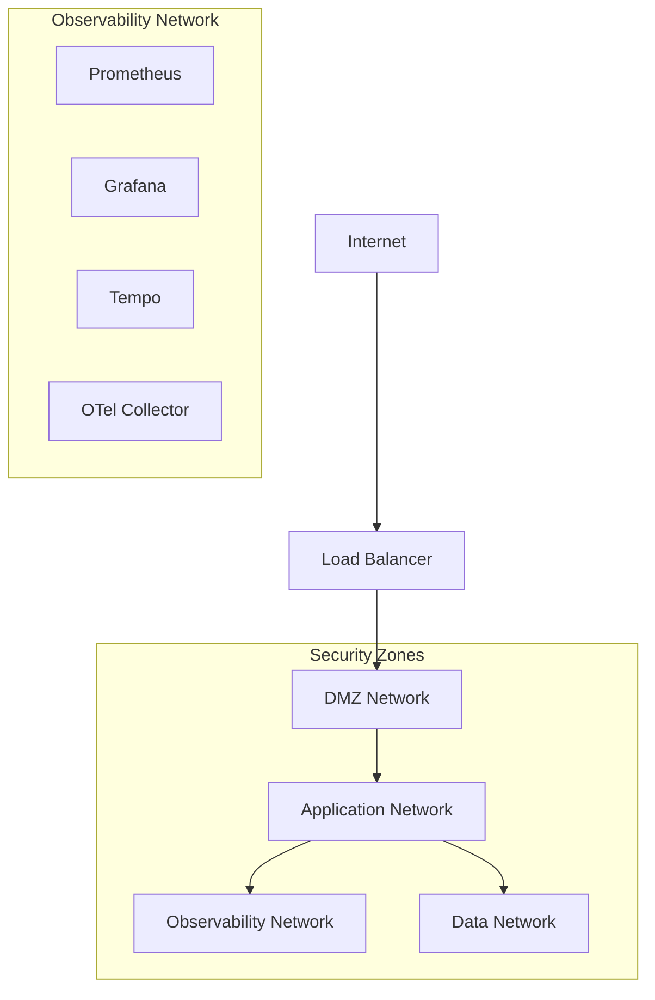

# Enterprise Observability Policies

> **Status**: Production Ready - Enhanced v2.0  
> **Last Updated**: 2025-07-17  
> **Maintainer**: Platform Engineering Team  
> **Related**: [Complete ADR Collection](enhanced-adr-collection.md) | [Implementation Playbook](implementation-playbook.md) | [Platform Engineering Guide](platform-engineering-guide.md) | [Production Operations Handbook](production-operations-handbook.md)

## Executive Summary

This document establishes comprehensive observability policies for enterprise Go applications, covering security, compliance, performance, and operational standards. These policies ensure observability systems provide value while maintaining security, compliance, and cost effectiveness.

**Key Policy Areas:**

- **Security Controls** with zero-trust principles and PII protection
- **Compliance Frameworks** for GDPR, CCPA, SOX, and industry standards
- **Performance Governance** with automated budget enforcement
- **Data Management** including retention, access, and lifecycle policies
- **Operational Standards** for incident response and SLA management
- **Cost Optimization** with cardinality budgets and efficiency targets

**Enforcement Mechanisms:**

- Automated policy validation in CI/CD pipelines
- Runtime compliance monitoring and alerting
- Regular audit procedures and compliance reporting
- Performance budget enforcement with circuit breakers
- Access control with role-based permissions

## Core Observability Principles

### 1. Security by Design

**Zero Trust Architecture**

- No inherent trust for any observability component
- All signals encrypted in transit and at rest
- Authentication and authorization for all access
- Continuous validation of security controls

**Defense in Depth**

- Multiple layers of security controls
- PII protection at collection, storage, and access levels
- Network segmentation for observability infrastructure
- Regular security audits and penetration testing

### 2. Privacy First

**Data Minimization**

- Collect only necessary observability data
- Automatic PII redaction and masking
- Configurable exposure levels by environment
- Regular data purging and lifecycle management

**Consent and Control**

- Clear data collection policies
- User control over personal data in observability signals
- Data portability and deletion capabilities
- Transparent data usage documentation

### 3. Operational Excellence

**Reliability Standards**

- 99.9% uptime for observability infrastructure
- Recovery time objectives (RTO) < 15 minutes
- Recovery point objectives (RPO) < 5 minutes
- Automated failover and disaster recovery

**Performance Standards**

- <15ms latency overhead from observability
- <25MB memory overhead per service instance
- <5% CPU overhead for instrumentation
- <1000 metric series per service

## Security Policies

### Access Control Framework

#### Role-Based Access Control (RBAC)

| Role | Logs | Metrics | Traces | Admin Functions | Environments |
|------|------|---------|--------|----------------|--------------|
| **Developer** | Read (Dev/Staging) | Read (All) | Read (Dev/Staging) | None | Dev, Staging |
| **SRE** | Read/Write (All) | Read/Write (All) | Read (All) | Limited | All |
| **Security** | Read (All) | Read (All) | Read (All) | Audit | All |
| **Compliance** | Audit (All) | Audit (All) | Audit (All) | Compliance | All |
| **Support** | Read (Production) | Read (Production) | None | None | Production |
| **Manager** | Dashboard (All) | Dashboard (All) | None | None | All |

#### Authentication Requirements

```yaml
# Authentication Policy Configuration
authentication:
  method: "oauth2_oidc"              # OAuth 2.0 with OpenID Connect
  provider: "google_workspace"       # Google Workspace SSO
  mfa_required: true                 # Multi-factor authentication mandatory
  session_timeout: "8h"             # 8-hour session timeout
  refresh_token_rotation: true      # Rotate refresh tokens
  
authorization:
  model: "rbac"                      # Role-based access control
  policy_engine: "open_policy_agent" # OPA for policy decisions
  default_deny: true                 # Deny by default
  audit_all_access: true            # Audit all access attempts
```

#### Network Security

**Infrastructure Segmentation**



**Network Policies**

```yaml
# Kubernetes Network Policies for Observability
apiVersion: networking.k8s.io/v1
kind: NetworkPolicy
metadata:
  name: observability-ingress
  namespace: observability
spec:
  podSelector:
    matchLabels:
      component: observability
  policyTypes:
  - Ingress
  - Egress
  ingress:
  - from:
    - namespaceSelector:
        matchLabels:
          name: application
    ports:
    - protocol: TCP
      port: 4318  # OTLP HTTP
    - protocol: TCP
      port: 8080  # Metrics
  egress:
  - to:
    - namespaceSelector:
        matchLabels:
          name: storage
    ports:
    - protocol: TCP
      port: 443   # Cloud storage
```

### Data Protection Standards

#### Encryption Requirements

**Data in Transit**

- TLS 1.3 minimum for all observability traffic
- Mutual TLS (mTLS) for internal service communication
- Certificate rotation every 90 days
- Forward secrecy enabled

**Data at Rest**

- AES-256 encryption for all stored observability data
- Key rotation every 365 days
- Hardware Security Module (HSM) for key management
- Encrypted database connections

#### PII Protection Implementation

**Classification Matrix**

```go
type PIIClassification struct {
    Level       PIILevel
    Examples    []string
    Handling    PIIHandling
    Retention   time.Duration
    Access      []Role
}

var PIIClassificationMatrix = map[PIILevel]PIIClassification{
    PIIHigh: {
        Level:    PIIHigh,
        Examples: []string{"SSN", "Credit Card", "Medical Records"},
        Handling: PIIExclude,
        Retention: 0, // Not stored
        Access:   []Role{RoleCompliance, RoleSecurity},
    },
    PIIMedium: {
        Level:    PIIMedium,
        Examples: []string{"Email", "Phone", "Full Name"},
        Handling: PIIRedact,
        Retention: 30 * 24 * time.Hour,
        Access:   []Role{RoleSRE, RoleCompliance, RoleSecurity},
    },
    PIILow: {
        Level:    PIILow,
        Examples: []string{"User ID", "Session ID", "IP Address"},
        Handling: PIIHash,
        Retention: 90 * 24 * time.Hour,
        Access:   []Role{RoleDeveloper, RoleSRE, RoleCompliance, RoleSecurity},
    },
}
```

**Automatic PII Detection**

```go
type PIIDetector struct {
    patterns map[PIIType]*regexp.Regexp
    config   PIIConfig
}

func NewPIIDetector() *PIIDetector {
    return &PIIDetector{
        patterns: map[PIIType]*regexp.Regexp{
            PIIEmail:      regexp.MustCompile(`\b[A-Za-z0-9._%+-]+@[A-Za-z0-9.-]+\.[A-Z|a-z]{2,}\b`),
            PIIPhone:      regexp.MustCompile(`\b\d{3}-\d{3}-\d{4}\b`),
            PIISSNPartial: regexp.MustCompile(`\b\d{3}-\d{2}-\d{4}\b`),
            PIICreditCard: regexp.MustCompile(`\b\d{4}[-\s]?\d{4}[-\s]?\d{4}[-\s]?\d{4}\b`),
            PIIIPAddress:  regexp.MustCompile(`\b\d{1,3}\.\d{1,3}\.\d{1,3}\.\d{1,3}\b`),
        },
    }
}

func (d *PIIDetector) ScanForPII(text string) []PIIViolation {
    var violations []PIIViolation
    
    for piiType, pattern := range d.patterns {
        if matches := pattern.FindAllString(text, -1); len(matches) > 0 {
            for _, match := range matches {
                violations = append(violations, PIIViolation{
                    Type:     piiType,
                    Value:    match,
                    Position: pattern.FindStringIndex(text),
                    Severity: d.getSeverity(piiType),
                })
            }
        }
    }
    
    return violations
}
```

## Compliance Frameworks

### GDPR Compliance (European Union)

#### Legal Basis and Consent

**Data Processing Justification**

- **Legitimate Interest**: Operational monitoring and system security
- **Contract Performance**: Service level agreement monitoring
- **Legal Obligation**: Security incident investigation and reporting
- **Consent**: Optional detailed performance analytics

**Implementation Requirements**

```go
type GDPRCompliance struct {
    LawfulBasis          string        `env:"GDPR_LAWFUL_BASIS" envDefault:"legitimate_interest"`
    ConsentRequired      bool          `env:"GDPR_CONSENT_REQUIRED" envDefault:"false"`
    DataMinimization     bool          `env:"GDPR_DATA_MINIMIZATION" envDefault:"true"`
    PurposeLimitation    bool          `env:"GDPR_PURPOSE_LIMITATION" envDefault:"true"`
    StorageLimitation    time.Duration `env:"GDPR_STORAGE_LIMIT" envDefault:"720h"` // 30 days
    AutomatedDecisionMaking bool       `env:"GDPR_AUTOMATED_DECISIONS" envDefault:"false"`
}

func (g *GDPRCompliance) ValidateDataCollection(data ObservabilityData) error {
    if g.DataMinimization {
        if err := g.validateMinimalDataCollection(data); err != nil {
            return fmt.Errorf("GDPR data minimization violation: %w", err)
        }
    }
    
    if g.PurposeLimitation {
        if err := g.validatePurposeAlignment(data); err != nil {
            return fmt.Errorf("GDPR purpose limitation violation: %w", err)
        }
    }
    
    return nil
}
```

#### Data Subject Rights Implementation

**Right to Access (Article 15)**

```go
func (s *ObservabilityService) HandleDataAccessRequest(ctx context.Context, req DataAccessRequest) (*DataAccessResponse, error) {
    // Authenticate data subject
    if err := s.auth.ValidateDataSubject(ctx, req.SubjectID, req.AuthToken); err != nil {
        return nil, fmt.Errorf("authentication failed: %w", err)
    }
    
    // Collect all observability data for subject
    logs, err := s.logService.GetLogsForSubject(ctx, req.SubjectID, req.TimeRange)
    if err != nil {
        return nil, fmt.Errorf("failed to retrieve logs: %w", err)
    }
    
    metrics, err := s.metricService.GetMetricsForSubject(ctx, req.SubjectID, req.TimeRange)
    if err != nil {
        return nil, fmt.Errorf("failed to retrieve metrics: %w", err)
    }
    
    traces, err := s.traceService.GetTracesForSubject(ctx, req.SubjectID, req.TimeRange)
    if err != nil {
        return nil, fmt.Errorf("failed to retrieve traces: %w", err)
    }
    
    // Audit the access request
    s.audit.LogDataAccess(ctx, AuditEntry{
        SubjectID: req.SubjectID,
        Action:    "data_access_request",
        Timestamp: time.Now(),
        LegalBasis: "gdpr_article_15",
    })
    
    return &DataAccessResponse{
        Logs:    logs,
        Metrics: metrics,
        Traces:  traces,
        Format:  req.Format, // JSON, CSV, or structured export
    }, nil
}
```

**Right to Erasure (Article 17)**

```go
func (s *ObservabilityService) HandleDataErasureRequest(ctx context.Context, req DataErasureRequest) error {
    // Validate legal grounds for erasure
    if !s.canEraseData(req) {
        return fmt.Errorf("erasure not permitted: data required for legitimate interest")
    }
    
    // Perform cascading deletion
    var errs []error
    
    if err := s.logService.EraseSubjectData(ctx, req.SubjectID); err != nil {
        errs = append(errs, fmt.Errorf("log erasure failed: %w", err))
    }
    
    if err := s.metricService.EraseSubjectData(ctx, req.SubjectID); err != nil {
        errs = append(errs, fmt.Errorf("metric erasure failed: %w", err))
    }
    
    if err := s.traceService.EraseSubjectData(ctx, req.SubjectID); err != nil {
        errs = append(errs, fmt.Errorf("trace erasure failed: %w", err))
    }
    
    if len(errs) > 0 {
        return fmt.Errorf("partial erasure failure: %v", errs)
    }
    
    // Audit the erasure
    s.audit.LogDataErasure(ctx, AuditEntry{
        SubjectID: req.SubjectID,
        Action:    "data_erasure_completed",
        Timestamp: time.Now(),
        LegalBasis: "gdpr_article_17",
    })
    
    return nil
}
```

### CCPA Compliance (California)

#### Consumer Rights Implementation

**Right to Know and Delete**

```go
type CCPACompliance struct {
    Enabled              bool   `env:"CCPA_ENABLED" envDefault:"false"`
    SaleOptOut           bool   `env:"CCPA_SALE_OPT_OUT" envDefault:"true"`
    DataSharingDisclosure bool   `env:"CCPA_SHARING_DISCLOSURE" envDefault:"true"`
    ConsumerRights       bool   `env:"CCPA_CONSUMER_RIGHTS" envDefault:"true"`
}

func (c *CCPACompliance) HandleConsumerRequest(ctx context.Context, req ConsumerRequest) error {
    switch req.Type {
    case "know":
        return c.handleRightToKnow(ctx, req)
    case "delete":
        return c.handleRightToDelete(ctx, req)
    case "opt_out":
        return c.handleOptOut(ctx, req)
    case "non_discrimination":
        return c.handleNonDiscrimination(ctx, req)
    default:
        return fmt.Errorf("unknown consumer request type: %s", req.Type)
    }
}

func (c *CCPACompliance) handleRightToKnow(ctx context.Context, req ConsumerRequest) error {
    // Provide information about data collection practices
    disclosure := DataDisclosure{
        Categories:        c.getDataCategories(),
        Sources:          c.getDataSources(),
        BusinessPurposes: c.getBusinessPurposes(),
        ThirdParties:     c.getThirdPartyDisclosures(),
        SaleOptOut:       c.SaleOptOut,
    }
    
    return c.sendDisclosure(ctx, req.ConsumerID, disclosure)
}
```

### SOX Compliance (Financial Services)

#### Internal Controls and Audit Trail

**Section 404 - Internal Control Requirements**

```go
type SOXControls struct {
    AuditTrail           bool   `env:"SOX_AUDIT_TRAIL" envDefault:"true"`
    DataIntegrity        bool   `env:"SOX_DATA_INTEGRITY" envDefault:"true"`
    AccessControls       bool   `env:"SOX_ACCESS_CONTROLS" envDefault:"true"`
    ChangeManagement     bool   `env:"SOX_CHANGE_MGMT" envDefault:"true"`
    SegregationOfDuties  bool   `env:"SOX_SEGREGATION" envDefault:"true"`
}

func (s *SOXControls) ValidateFinancialObservability(ctx context.Context, data FinancialObservabilityData) error {
    if s.AuditTrail {
        if err := s.validateAuditTrail(data); err != nil {
            return fmt.Errorf("SOX audit trail violation: %w", err)
        }
    }
    
    if s.DataIntegrity {
        if err := s.validateDataIntegrity(data); err != nil {
            return fmt.Errorf("SOX data integrity violation: %w", err)
        }
    }
    
    if s.AccessControls {
        if err := s.validateAccessControls(ctx, data); err != nil {
            return fmt.Errorf("SOX access control violation: %w", err)
        }
    }
    
    return nil
}

func (s *SOXControls) validateAuditTrail(data FinancialObservabilityData) error {
    // Ensure all financial system observability has complete audit trail
    if data.Source == "financial_system" {
        if data.AuditTrail == nil || len(data.AuditTrail.Events) == 0 {
            return errors.New("financial observability data missing audit trail")
        }
        
        // Validate audit trail completeness
        for _, event := range data.AuditTrail.Events {
            if event.UserID == "" || event.Action == "" || event.Timestamp.IsZero() {
                return errors.New("incomplete audit trail event")
            }
        }
    }
    
    return nil
}
```

## Performance Governance

### Performance Budgets and Enforcement

#### Automated Budget Validation

```yaml
# Performance Budget CI/CD Pipeline
name: Performance Budget Validation
on:
  pull_request:
    paths: ['internal/**', 'go.mod', 'go.sum']

jobs:
  performance-validation:
    runs-on: ubuntu-latest
    steps:
      - name: Baseline Performance Test
        run: |
          go test -bench=BenchmarkBaseline -count=5 -benchmem > baseline.txt
          
      - name: Instrumented Performance Test  
        run: |
          go test -bench=BenchmarkInstrumented -count=5 -benchmem > instrumented.txt
          
      - name: Validate Performance Budget
        run: |
          go run tools/perf-validator/main.go \
            --baseline=baseline.txt \
            --instrumented=instrumented.txt \
            --budget-config=configs/performance-budgets.yaml \
            --fail-on-violation=true
```

#### Runtime Performance Monitoring

```go
type PerformanceMonitor struct {
    budgets     PerformanceBudgets
    violations  atomic.Int64
    alerts      chan PerformanceAlert
    circuitBreaker *PerformanceCircuitBreaker
}

func (pm *PerformanceMonitor) MonitorRequestPerformance(ctx context.Context, req *http.Request) {
    start := time.Now()
    
    defer func() {
        duration := time.Since(start)
        
        // Check against latency budget
        if duration > pm.budgets.MaxRequestLatency {
            pm.violations.Add(1)
            pm.alerts <- PerformanceAlert{
                Type:        "latency_budget_exceeded",
                Request:     req.URL.Path,
                Observed:    duration,
                Budget:      pm.budgets.MaxRequestLatency,
                Severity:    "warning",
                Timestamp:   time.Now(),
            }
        }
        
        // Circuit breaker check
        if pm.violations.Load() > 100 { // 100 violations in window
            pm.circuitBreaker.TripBreaker("performance_budget_exceeded")
        }
    }()
}
```

### Cost Optimization Policies

#### Cardinality Budget Enforcement

```go
type CardinalityGovernor struct {
    budgets           map[string]int // service -> max series count
    currentCounts     map[string]int
    violationHandlers []ViolationHandler
    enabled           atomic.Bool
}

func (cg *CardinalityGovernor) ValidateMetricRegistration(serviceName, metricName string, labels []string) error {
    if !cg.enabled.Load() {
        return nil
    }
    
    estimatedCardinality := cg.estimateCardinality(metricName, labels)
    currentCount := cg.currentCounts[serviceName]
    budget := cg.budgets[serviceName]
    
    if currentCount + estimatedCardinality > budget {
        violation := CardinalityViolation{
            Service:              serviceName,
            Metric:              metricName,
            EstimatedCardinality: estimatedCardinality,
            CurrentCount:        currentCount,
            Budget:             budget,
            Timestamp:          time.Now(),
        }
        
        // Execute violation handlers
        for _, handler := range cg.violationHandlers {
            if err := handler.Handle(violation); err != nil {
                // Log handler error but don't fail the registration
                log.Printf("cardinality violation handler error: %v", err)
            }
        }
        
        return fmt.Errorf("cardinality budget exceeded: service=%s, current=%d, estimated=%d, budget=%d",
            serviceName, currentCount, estimatedCardinality, budget)
    }
    
    return nil
}
```

#### Storage Cost Management

```go
type StorageCostManager struct {
    policies        []RetentionPolicy
    costLimits      map[string]float64 // environment -> max monthly cost USD
    currentCosts    map[string]float64
    alertThresholds map[string]float64 // environment -> alert threshold (0.8 = 80%)
}

func (scm *StorageCostManager) MonitorStorageCosts(ctx context.Context) error {
    for env, limit := range scm.costLimits {
        current := scm.currentCosts[env]
        threshold := scm.alertThresholds[env]
        
        if current > limit {
            return fmt.Errorf("storage cost limit exceeded: env=%s, current=$%.2f, limit=$%.2f",
                env, current, limit)
        }
        
        if current > limit * threshold {
            scm.sendCostAlert(CostAlert{
                Environment: env,
                CurrentCost: current,
                Limit:       limit,
                Utilization: current / limit,
                Severity:    "warning",
            })
        }
    }
    
    return nil
}
```

## Data Management Policies

### Retention and Lifecycle Management

#### Automated Data Lifecycle

```go
type DataLifecycleManager struct {
    policies    []RetentionPolicy
    schedulers  map[SignalType]LifecycleScheduler
    auditor     AuditLogger
}

type RetentionPolicy struct {
    SignalType    SignalType    `yaml:"signal_type"`
    Environment   string        `yaml:"environment"`
    RetentionDays int           `yaml:"retention_days"`
    ArchiveAfter  int           `yaml:"archive_after_days"`
    DeleteAfter   int           `yaml:"delete_after_days"`
    PIIHandling   PIIHandling   `yaml:"pii_handling"`
    LegalHolds    []string      `yaml:"legal_holds"`
}

func (dlm *DataLifecycleManager) ApplyRetentionPolicies(ctx context.Context) error {
    for _, policy := range dlm.policies {
        scheduler := dlm.schedulers[policy.SignalType]
        
        // Archive old data
        if policy.ArchiveAfter > 0 {
            archiveCutoff := time.Now().AddDate(0, 0, -policy.ArchiveAfter)
            if err := scheduler.ArchiveDataBefore(ctx, archiveCutoff); err != nil {
                return fmt.Errorf("archive failed for %s: %w", policy.SignalType, err)
            }
        }
        
        // Delete expired data (check legal holds first)
        if policy.DeleteAfter > 0 && len(policy.LegalHolds) == 0 {
            deleteCutoff := time.Now().AddDate(0, 0, -policy.DeleteAfter)
            if err := scheduler.DeleteDataBefore(ctx, deleteCutoff); err != nil {
                return fmt.Errorf("deletion failed for %s: %w", policy.SignalType, err)
            }
            
            // Audit deletion
            dlm.auditor.LogDataDeletion(ctx, DataDeletionAudit{
                SignalType:  policy.SignalType,
                Environment: policy.Environment,
                Cutoff:      deleteCutoff,
                Policy:      policy,
                Timestamp:   time.Now(),
            })
        }
    }
    
    return nil
}
```

#### Data Classification and Handling

```yaml
# Data Classification Configuration
data_classification:
  public:
    retention_days: 2555  # 7 years
    encryption: "aes_256"
    access_level: "public"
    examples: ["service_metrics", "system_health"]
    
  internal:
    retention_days: 1095  # 3 years
    encryption: "aes_256" 
    access_level: "employee"
    examples: ["application_logs", "performance_traces"]
    
  confidential:
    retention_days: 365   # 1 year
    encryption: "aes_256_hsm"
    access_level: "need_to_know"
    examples: ["error_logs_with_context", "debug_traces"]
    
  restricted:
    retention_days: 90    # 90 days
    encryption: "aes_256_hsm"
    access_level: "authorized_only"
    examples: ["pii_containing_logs", "security_traces"]
```

### Backup and Disaster Recovery

#### Backup Strategy

```go
type BackupStrategy struct {
    Schedule        string        `yaml:"schedule"`          // Cron expression
    Retention       int           `yaml:"retention_days"`    // Backup retention
    Compression     bool          `yaml:"compression"`       // Compress backups
    Encryption      bool          `yaml:"encryption"`        // Encrypt backups
    OffSiteStorage  bool          `yaml:"offsite_storage"`   // Store offsite
    TestFrequency   string        `yaml:"test_frequency"`    // Restore test frequency
}

var ObservabilityBackupStrategies = map[SignalType]BackupStrategy{
    SignalLogs: {
        Schedule:       "0 2 * * *",  // Daily at 2 AM
        Retention:      30,           // 30 days
        Compression:    true,
        Encryption:     true,
        OffSiteStorage: true,
        TestFrequency:  "weekly",
    },
    SignalMetrics: {
        Schedule:       "0 3 * * 0",  // Weekly on Sunday at 3 AM
        Retention:      90,           // 90 days
        Compression:    true,
        Encryption:     true,
        OffSiteStorage: true,
        TestFrequency:  "monthly",
    },
    SignalTraces: {
        Schedule:       "0 1 * * *",  // Daily at 1 AM
        Retention:      14,           // 14 days
        Compression:    true,
        Encryption:     true,
        OffSiteStorage: false,        // Keep local for traces
        TestFrequency:  "weekly",
    },
}
```

#### Disaster Recovery Procedures

```go
type DisasterRecoveryPlan struct {
    RTO               time.Duration `yaml:"rto"`                // Recovery Time Objective
    RPO               time.Duration `yaml:"rpo"`                // Recovery Point Objective
    BackupLocations   []string      `yaml:"backup_locations"`   // Geographic locations
    FailoverProcedure []Step        `yaml:"failover_procedure"` // Automated steps
    TestSchedule      string        `yaml:"test_schedule"`      // DR test frequency
}

var ObservabilityDRPlan = DisasterRecoveryPlan{
    RTO: 15 * time.Minute,  // 15-minute recovery time
    RPO: 5 * time.Minute,   // 5-minute data loss tolerance
    BackupLocations: []string{
        "us-east1",   // Primary
        "us-west1",   // Secondary
        "europe-west1", // Tertiary
    },
    FailoverProcedure: []Step{
        {Action: "detect_failure", Timeout: 2 * time.Minute},
        {Action: "validate_backup_integrity", Timeout: 3 * time.Minute},
        {Action: "spin_up_standby_infrastructure", Timeout: 5 * time.Minute},
        {Action: "restore_data", Timeout: 5 * time.Minute},
        {Action: "validate_functionality", Timeout: 2 * time.Minute},
        {Action: "update_dns_routing", Timeout: 1 * time.Minute},
    },
    TestSchedule: "monthly", // Monthly DR tests
}
```

## Operational Standards

### Service Level Objectives (SLOs)

#### Observability Infrastructure SLOs

```yaml
# Observability Infrastructure SLOs
slos:
  availability:
    target: 99.9%               # 99.9% uptime
    measurement_window: "30d"   # 30-day rolling window
    error_budget: 43.2          # 43.2 minutes/month
    
  latency:
    target_p95: "500ms"         # 95th percentile < 500ms
    target_p99: "2s"            # 99th percentile < 2s
    measurement_window: "24h"   # 24-hour rolling window
    
  data_freshness:
    logs:
      target: "30s"             # Logs available within 30s
      measurement_window: "1h"
    metrics:
      target: "15s"             # Metrics available within 15s  
      measurement_window: "1h"
    traces:
      target: "60s"             # Traces available within 60s
      measurement_window: "1h"
      
  data_completeness:
    logs:
      target: 99.5%             # 99.5% log delivery
      measurement_window: "24h"
    metrics:
      target: 99.9%             # 99.9% metric delivery
      measurement_window: "24h"
    traces:
      target: 99.0%             # 99.0% trace delivery
      measurement_window: "24h"
```

#### Application Observability SLOs

```go
type ApplicationSLOs struct {
    InstrumentationOverhead struct {
        MaxLatencyIncrease  time.Duration `yaml:"max_latency_increase"`
        MaxMemoryIncrease   int64         `yaml:"max_memory_increase"`
        MaxCPUIncrease      float64       `yaml:"max_cpu_increase"`
    } `yaml:"instrumentation_overhead"`
    
    DataQuality struct {
        TraceCompleteness   float64 `yaml:"trace_completeness"`    // % of traces with all spans
        LogCorrelation      float64 `yaml:"log_correlation"`       // % of logs with trace_id
        MetricAccuracy      float64 `yaml:"metric_accuracy"`       // % of metrics within tolerance
    } `yaml:"data_quality"`
    
    AlertingPerformance struct {
        FalsePositiveRate   float64       `yaml:"false_positive_rate"`  // < 5% false positives
        AlertLatency        time.Duration `yaml:"alert_latency"`        // < 2 minutes to alert
        EscalationAccuracy  float64       `yaml:"escalation_accuracy"`  // > 95% correct escalation
    } `yaml:"alerting_performance"`
}
```

### Incident Response Procedures

#### Observability Incident Classification

```go
type IncidentSeverity int

const (
    SeverityCritical IncidentSeverity = iota // Complete observability loss
    SeverityHigh                             // Partial observability loss
    SeverityMedium                           // Degraded observability
    SeverityLow                              // Minor observability issues
)

type ObservabilityIncident struct {
    ID              string            `json:"id"`
    Severity        IncidentSeverity  `json:"severity"`
    AffectedSignals []SignalType      `json:"affected_signals"`
    Environment     string            `json:"environment"`
    Impact          IncidentImpact    `json:"impact"`
    StartTime       time.Time         `json:"start_time"`
    DetectionTime   time.Time         `json:"detection_time"`
    ResponseTime    time.Time         `json:"response_time"`
    ResolutionTime  *time.Time        `json:"resolution_time,omitempty"`
    Postmortem      *PostmortemLink   `json:"postmortem,omitempty"`
}

type IncidentImpact struct {
    AffectedServices    []string `json:"affected_services"`
    DataLossPercentage  float64  `json:"data_loss_percentage"`
    AlertingDisabled    bool     `json:"alerting_disabled"`
    DebuggingImpaired   bool     `json:"debugging_impaired"`
    ComplianceRisk      bool     `json:"compliance_risk"`
}
```

#### Automated Incident Detection

```go
type IncidentDetector struct {
    healthChecks    []HealthCheck
    alertManager    AlertManager
    escalationRules []EscalationRule
    notifiers       []Notifier
}

func (id *IncidentDetector) DetectObservabilityIncidents(ctx context.Context) error {
    for _, check := range id.healthChecks {
        result, err := check.Execute(ctx)
        if err != nil {
            return fmt.Errorf("health check failed: %w", err)
        }
        
        if !result.Healthy {
            incident := &ObservabilityIncident{
                ID:              generateIncidentID(),
                Severity:        id.calculateSeverity(result),
                AffectedSignals: result.AffectedSignals,
                Environment:     result.Environment,
                Impact:          id.calculateImpact(result),
                StartTime:       result.IssueStartTime,
                DetectionTime:   time.Now(),
            }
            
            // Create alert
            alert := Alert{
                Title:       fmt.Sprintf("Observability Incident: %s", incident.ID),
                Description: result.Description,
                Severity:    incident.Severity,
                Incident:    incident,
            }
            
            if err := id.alertManager.CreateAlert(ctx, alert); err != nil {
                return fmt.Errorf("failed to create alert: %w", err)
            }
            
            // Start escalation
            if err := id.escalate(ctx, incident); err != nil {
                return fmt.Errorf("failed to escalate incident: %w", err)
            }
        }
    }
    
    return nil
}
```

### Quality Assurance

#### Data Quality Monitoring

```go
type DataQualityMonitor struct {
    checks          []DataQualityCheck
    thresholds      QualityThresholds
    violationLogger ViolationLogger
}

type DataQualityCheck interface {
    Execute(ctx context.Context, data ObservabilityData) (QualityResult, error)
    Type() DataQualityType
    Severity() QualitySeverity
}

type TraceCompletenessCheck struct {
    expectedSpans map[string][]string // service -> expected span names
    tolerance     float64             // acceptable missing span percentage
}

func (tcc *TraceCompletenessCheck) Execute(ctx context.Context, data ObservabilityData) (QualityResult, error) {
    if data.Type != DataTypeTrace {
        return QualityResult{}, fmt.Errorf("invalid data type for trace completeness check")
    }
    
    trace := data.Trace
    completeness := 0.0
    
    for service, expectedSpanNames := range tcc.expectedSpans {
        serviceSpans := trace.GetSpansForService(service)
        actualSpanNames := extractSpanNames(serviceSpans)
        
        missing := findMissingSpans(expectedSpanNames, actualSpanNames)
        serviceCompleteness := float64(len(expectedSpanNames)-len(missing)) / float64(len(expectedSpanNames))
        
        completeness += serviceCompleteness
    }
    
    completeness /= float64(len(tcc.expectedSpans))
    
    return QualityResult{
        Type:        DataQualityTraceCompleteness,
        Score:       completeness,
        Passed:      completeness >= (1.0 - tcc.tolerance),
        Details:     map[string]any{"completeness_percentage": completeness * 100},
        Timestamp:   time.Now(),
    }, nil
}
```

#### Compliance Auditing

```go
type ComplianceAuditor struct {
    frameworks []ComplianceFramework
    schedules  map[ComplianceFramework]AuditSchedule
    reporters  []ComplianceReporter
}

type AuditSchedule struct {
    Frequency    time.Duration `yaml:"frequency"`     // How often to audit
    Scope        []string      `yaml:"scope"`         // What to audit
    Retention    time.Duration `yaml:"retention"`     // How long to keep results
    Automated    bool          `yaml:"automated"`     // Automated vs manual
    Stakeholders []string      `yaml:"stakeholders"`  // Who gets reports
}

func (ca *ComplianceAuditor) RunScheduledAudits(ctx context.Context) error {
    for framework, schedule := range ca.schedules {
        if ca.shouldRunAudit(framework, schedule) {
            auditResult, err := ca.executeAudit(ctx, framework, schedule)
            if err != nil {
                return fmt.Errorf("audit failed for %s: %w", framework, err)
            }
            
            // Generate compliance report
            report := ComplianceReport{
                Framework:   framework,
                AuditDate:   time.Now(),
                Scope:       schedule.Scope,
                Results:     auditResult,
                Compliant:   auditResult.OverallCompliance >= 0.95, // 95% compliance threshold
                Violations:  auditResult.Violations,
                Recommendations: auditResult.Recommendations,
            }
            
            // Send to stakeholders
            for _, reporter := range ca.reporters {
                if err := reporter.SendReport(ctx, report, schedule.Stakeholders); err != nil {
                    log.Printf("failed to send compliance report: %v", err)
                }
            }
        }
    }
    
    return nil
}
```

## Technology Standards

### Approved Technology Stack

#### Core Observability Components

```yaml
# Approved Technology Matrix
core_stack:
  logging:
    library: "log/slog"              # Go standard library
    version: "go1.24+"
    format: "json"
    structured: true
    
  tracing:
    library: "go.opentelemetry.io/otel"
    version: "v1.37.0+"
    protocol: "otlp_http"
    sampling: "parent_based"
    
  metrics:
    library: "github.com/prometheus/client_golang"
    version: "v1.22.0+"
    format: "prometheus"
    cardinality_limit: 1000
    
  http_framework:
    primary: "github.com/gin-gonic/gin"
    version: "v1.10.1+"
    middleware_pattern: "chain"
    
infrastructure:
  container_runtime: "docker"
  orchestration: "kubernetes"
  service_mesh: "istio"              # Optional for Phase 8
  
cloud_services:
  primary_cloud: "gcp"
  compute: "cloud_run"
  storage: "cloud_storage"
  observability: "cloud_operations_suite"
  iam: "workload_identity_federation"
```

#### Deployment Standards

```yaml
# Deployment Configuration Standards
deployment:
  environments:
    - name: "development"
      observability_level: "full"
      retention_days: 7
      pii_mode: "full"
      performance_budget: "relaxed"
      
    - name: "staging"
      observability_level: "production_like"
      retention_days: 30
      pii_mode: "redacted"
      performance_budget: "production_like"
      
    - name: "production"
      observability_level: "optimized"
      retention_days: 90
      pii_mode: "redacted"
      performance_budget: "strict"
      
  infrastructure_as_code:
    tool: "terraform"
    version: "1.6+"
    modules: "required"
    state_backend: "gcs"
    
  continuous_integration:
    pipeline: "github_actions"
    required_checks:
      - "unit_tests"
      - "integration_tests"
      - "performance_budget_validation"
      - "security_scan"
      - "compliance_check"
      - "cardinality_validation"
```

## Monitoring and Alerting Standards

### Alert Classification and Routing

#### Alert Severity Matrix

```go
type AlertSeverity int

const (
    SeverityCritical AlertSeverity = iota // Immediate response required
    SeverityHigh                          // Response within 1 hour
    SeverityMedium                        // Response within 4 hours
    SeverityLow                           // Response within 24 hours
    SeverityInfo                          // Informational only
)

type AlertConfiguration struct {
    Name            string            `yaml:"name"`
    Query           string            `yaml:"query"`
    Severity        AlertSeverity     `yaml:"severity"`
    Threshold       float64           `yaml:"threshold"`
    Duration        time.Duration     `yaml:"duration"`
    EvaluationInterval time.Duration  `yaml:"evaluation_interval"`
    Labels          map[string]string `yaml:"labels"`
    Annotations     map[string]string `yaml:"annotations"`
    Runbook         string            `yaml:"runbook"`
    EscalationRules []EscalationRule  `yaml:"escalation_rules"`
}

var ObservabilityAlerts = []AlertConfiguration{
    {
        Name:      "ObservabilityDataLoss",
        Query:     "rate(logs_received_total[5m]) < 0.95 * rate(logs_received_total[5m] offset 1h)",
        Severity:  SeverityCritical,
        Threshold: 0.05, // 5% data loss
        Duration:  2 * time.Minute,
        EvaluationInterval: 30 * time.Second,
        Labels: map[string]string{
            "component": "observability",
            "team":      "platform",
        },
        Annotations: map[string]string{
            "summary":     "Observability data loss detected",
            "description": "Log ingestion rate has dropped by more than 5% compared to historical baseline",
            "impact":      "Potential loss of observability data affecting debugging and monitoring capabilities",
        },
        Runbook: "https://runbooks.company.com/observability/data-loss",
        EscalationRules: []EscalationRule{
            {Delay: 0, Recipients: []string{"platform-oncall"}},
            {Delay: 15 * time.Minute, Recipients: []string{"platform-team", "engineering-manager"}},
            {Delay: 1 * time.Hour, Recipients: []string{"cto", "head-of-engineering"}},
        },
    },
    {
        Name:      "HighObservabilityLatency",
        Query:     "histogram_quantile(0.95, rate(observability_request_duration_seconds_bucket[5m])) > 0.5",
        Severity:  SeverityHigh,
        Threshold: 0.5, // 500ms
        Duration:  5 * time.Minute,
        EvaluationInterval: 1 * time.Minute,
        Labels: map[string]string{
            "component": "observability",
            "team":      "platform",
        },
        Annotations: map[string]string{
            "summary":     "High observability system latency",
            "description": "95th percentile latency for observability requests exceeds 500ms",
            "impact":      "Slow dashboards and delayed alerting affecting incident response",
        },
        Runbook: "https://runbooks.company.com/observability/high-latency",
        EscalationRules: []EscalationRule{
            {Delay: 0, Recipients: []string{"platform-oncall"}},
            {Delay: 30 * time.Minute, Recipients: []string{"platform-team"}},
        },
    },
}
```

#### On-Call Procedures

```yaml
# On-Call Rotation Configuration
oncall:
  rotations:
    - name: "platform-primary"
      duration: "1w"              # 1-week rotations
      handoff_time: "09:00"       # 9 AM handoffs
      timezone: "UTC"
      backup_required: true
      
    - name: "platform-secondary"  
      duration: "1w"
      handoff_time: "09:00"
      timezone: "UTC"
      escalation_delay: "15m"     # Escalate after 15 minutes
      
  escalation_policies:
    - name: "observability-critical"
      steps:
        - delay: "0m"
          targets: ["platform-primary"]
          method: ["sms", "call"]
        - delay: "5m"
          targets: ["platform-primary"]
          method: ["sms", "call"]
        - delay: "15m"
          targets: ["platform-secondary", "engineering-manager"]
          method: ["sms", "call"]
        - delay: "30m"
          targets: ["platform-team"]
          method: ["slack"]
        - delay: "60m"
          targets: ["cto"]
          method: ["email", "call"]
          
  acknowledgment:
    timeout: "10m"               # Auto-escalate if not acked in 10 min
    required_actions:
      - "acknowledge_alert"
      - "join_incident_channel"
      - "update_status_page"
```

## Absolute DOs and DON'Ts

### 🟢 ABSOLUTE DOs

#### Security and Compliance

- **DO** encrypt all observability data in transit and at rest
- **DO** implement role-based access control for all observability signals
- **DO** automatically redact PII based on environment configuration
- **DO** maintain complete audit trails for all data access
- **DO** implement data retention policies with automated enforcement
- **DO** validate compliance requirements before deploying to production
- **DO** use Workload Identity Federation instead of service account keys
- **DO** implement network segmentation for observability infrastructure

#### Performance and Reliability

- **DO** enforce performance budgets with automated CI/CD validation
- **DO** implement cardinality limits with golden file validation
- **DO** use circuit breakers to protect against observability overhead
- **DO** implement graceful degradation when observability systems fail
- **DO** monitor the monitors - instrument your observability infrastructure
- **DO** use sampling strategies to control trace volume in production
- **DO** implement health checks for all observability components

#### Development Practices

- **DO** use dependency injection for all observability components
- **DO** implement context-first propagation for all cross-cutting concerns
- **DO** use structured logging with consistent field naming
- **DO** implement proper error classification with actionable alerting
- **DO** write tests that validate observability behavior
- **DO** document all observability architecture decisions
- **DO** implement import boundary checking to prevent coupling

### 🔴 ABSOLUTE DON'Ts

#### Security and Compliance Violations

- **DON'T** log raw PII without explicit redaction or hashing
- **DON'T** include sensitive data in metric labels or trace attributes
- **DON'T** store observability data longer than legally required
- **DON'T** allow unauthenticated access to any observability endpoints
- **DON'T** use shared credentials or service account keys
- **DON'T** ignore compliance requirements for observability data
- **DON'T** collect more personal data than necessary for operational purposes

#### Performance and Reliability Anti-Patterns

- **DON'T** ignore performance budgets or disable budget validation
- **DON'T** use unbounded cardinality in metrics (user IDs, request IDs, etc.)
- **DON'T** implement synchronous observability operations in request paths
- **DON'T** use package-level global state for observability components
- **DON'T** ignore observability system failures (fail open, not closed)
- **DON'T** implement manual scaling for observability infrastructure
- **DON'T** use printf-style logging in production code

#### Development Anti-Patterns

- **DON'T** couple domain logic to specific observability frameworks
- **DON'T** implement multiple observation points for the same errors
- **DON'T** use string matching or parsing for error handling decisions
- **DON'T** ignore context propagation in any request-processing function
- **DON'T** implement observability as an afterthought
- **DON'T** skip testing of observability code paths
- **DON'T** use different logging frameworks within the same application

## Implementation Checklist

### Pre-Production Deployment

#### Security Review

- [ ] All PII redaction rules implemented and tested
- [ ] RBAC configured for all observability endpoints
- [ ] Network security policies implemented
- [ ] Encryption enabled for all data paths
- [ ] Service account keys eliminated (WIF only)
- [ ] Security scanning completed with no critical issues

#### Compliance Review  

- [ ] Data retention policies configured and automated
- [ ] GDPR/CCPA compliance validated (if applicable)
- [ ] Data processing agreements in place
- [ ] Audit trail implementation verified
- [ ] Legal review completed for data collection practices

#### Performance Review

- [ ] Performance budgets defined and CI/CD validation enabled
- [ ] Cardinality limits implemented with golden file validation
- [ ] Load testing completed with observability overhead measured
- [ ] Circuit breakers implemented and tested
- [ ] Graceful degradation verified under failure conditions

#### Operational Review

- [ ] SLOs defined for observability infrastructure
- [ ] Alerting rules implemented with proper escalation
- [ ] Runbooks created for common observability issues
- [ ] On-call procedures documented and teams trained
- [ ] Disaster recovery procedures tested

#### Quality Review

- [ ] Data quality monitoring implemented
- [ ] Correlation between logs, metrics, and traces verified
- [ ] Alert false positive rate measured and optimized
- [ ] Documentation review completed
- [ ] Team training completed

This comprehensive policy framework ensures that observability implementations are secure, compliant, performant, and operationally excellent while providing clear guidance for development teams.
